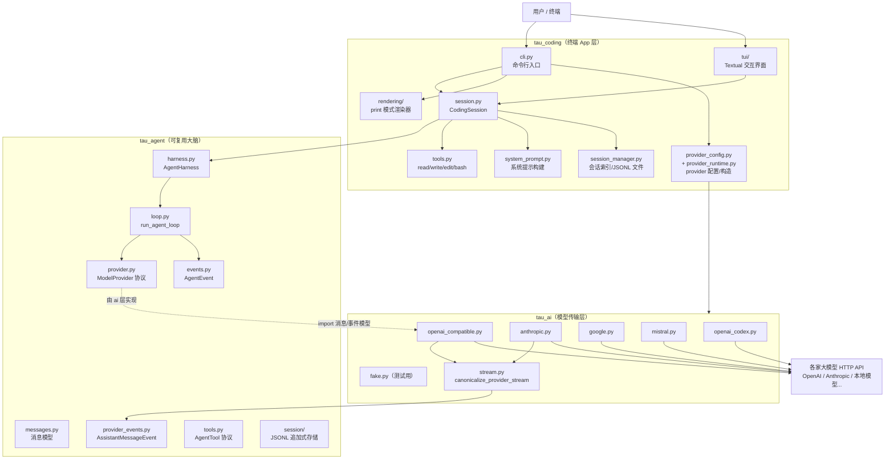
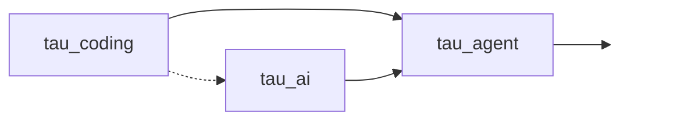
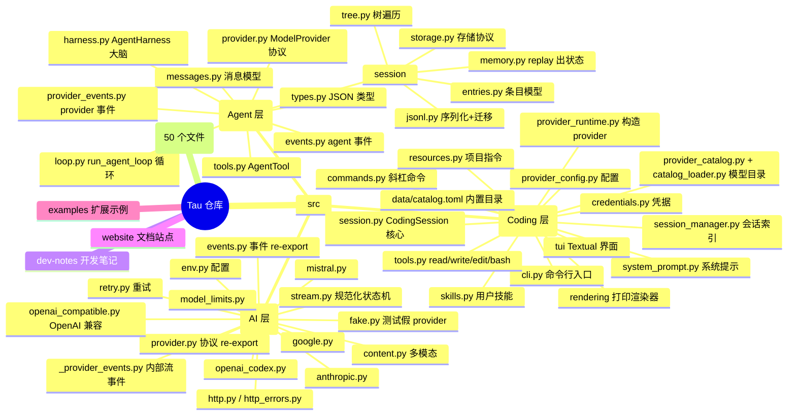

# Tau 项目学习总览与阶梯学习路线

> 本系列文档面向**入门开发者**，目标是让你快速吃透 Tau 的三层架构、理解一个终端编码 Agent 的底层运行原理，并能上手修改 / 二次开发。
>
> 所有内容严格基于 `src/` 下的真实源码，不编造任何 API 或行为。

## 目录（本系列共 6 篇）

1. **`00-总览与学习路线.md`**（本篇）：项目定位、环境搭建、阶梯阅读计划、可视化总图。
2. **`01-AI层手册-tau_ai.md`**：LLM 抽象适配层逐文件精读。
3. **`02-Agent层手册-tau_agent.md`**：Agent 调度核心引擎逐文件精读（**项目核心**）。
4. **`03-Coding层手册-tau_coding.md`**：终端 TUI 应用层逐文件精读。
5. **`04-全链路运行剖析.md`**：一次用户提问从输入到输出的完整时序 + Agent 循环每一步。
6. **`05-拓展实操案例.md`**：新增自定义工具、切换本地大模型、改终端界面等入门修改示例。

---

## 一、Tau 是什么

Tau 是一个**活在终端里的编码 Agent**，同时也是一份**教学项目**——它用尽量少的代码，完整演示"一个编码 Agent 系统长什么样"。

你在终端里输入自然语言（例如"解释这个仓库""加个测试""修一下这个报错"），Tau 会：

- 读文件（`read`）
- 写文件（`write`）
- 精确编辑（`edit`）
- 执行 Shell 命令（`bash`）
- 流式展示它正在做什么
- 把整段会话以 JSONL 持久化到 `~/.tau/sessions/`

它支持 OpenAI、Anthropic、OpenAI Codex 订阅、OpenRouter、Hugging Face，以及所有兼容 OpenAI 接口的**本地模型**。

### 项目元信息（来自 `pyproject.toml`）

| 项目 | 值 |
| --- | --- |
| PyPI 包名 | `tau-ai` |
| 命令行入口 | `tau`（映射到 `tau_coding.cli:app`） |
| Python 版本 | `>=3.12`（用到 PEP 695 `type` 语法、`match` 等新特性） |
| 关键依赖 | `anyio`、`httpx[socks]`、`pydantic>=2.11`、`rich`、`textual`、`typer`、`pillow`、`pygments`、`packaging` |
| 构建后端 | `hatchling`，打包 `src/tau_ai`、`src/tau_agent`、`src/tau_coding` 三个包 |

---

## 二、三层架构与单向依赖

Tau 把系统拆成三个 Python 包，依赖**严格自上而下、无循环**：

```text
tau_coding  →  tau_agent  →  tau_ai
（终端 App）    （可复用大脑）   （模型传输层）
```

三句话概括职责边界（源自 `README.md`）：

```text
AgentHarness  = 可复用的大脑（tau_agent）
CodingSession = 编码 Agent 环境（tau_coding）
TUI           = 众多可能前端之一（tau_coding.tui）
```

| 层 | 包 | 职责 | 关键点 |
| --- | --- | --- | --- |
| AI 层 | `tau_ai` | LLM 抽象适配层：把各家模型的流式输出**收拢**成一套统一事件 | 代码极简、逻辑清晰，**优先学** |
| Agent 层 | `tau_agent` | Agent 调度核心：循环、消息、工具、事件、会话持久化 | 摒弃多余抽象，**核心学习主体** |
| Coding 层 | `tau_coding` | 终端 App：Textual+Rich 交互、文件/Shell 工具、配置、命令、会话文件 | 可完整运行，主打教学 |

> **重要发现（贴合源码）**：`tau_ai` 的公共契约（`ModelProvider`、`AssistantMessageEvent` 等）实际**定义在 `tau_agent` 里**，`tau_ai` 只是 re-export。例如 `tau_ai/provider.py` 只有一行：
>
> ```python
> from tau_agent.provider import CancellationToken, ModelProvider
> ```
>
> 这印证了单向依赖：`tau_ai` 依赖 `tau_agent` 的消息/事件模型，但 `tau_agent` **绝不** import `tau_ai`。核心大脑不认识任何具体 provider，只认识 `ModelProvider` 协议。

---

## 三、整体架构图（Mermaid）



## 四、模块依赖图（严格单向）



- `tau_coding` 同时依赖 `tau_agent`（大脑）和 `tau_ai`（构造具体 provider）。
- `tau_ai` 依赖 `tau_agent` 的消息/事件/工具模型。
- `tau_agent` 是最底层，**谁都不依赖**（除了标准库和 pydantic）。

---

## 五、前置入门准备

### 5.1 环境要求

- Python **3.12 或更高**（必须，代码用了 3.12+ 语法）。
- 推荐使用 [`uv`](https://docs.astral.sh/uv/) 管理环境（项目 `AGENTS.md` 要求所有命令走 `uv`）。

### 5.2 本地开发安装

```bash
git clone https://github.com/huggingface/tau.git
cd tau
uv sync --dev          # 安装运行 + 开发依赖（mypy/pytest/ruff）
uv run tau --version   # 验证安装
```

如果想让 `tau` 命令全局可用（指向你的源码 checkout）：

```bash
uv tool install --editable --force .
```

> 注意（来自 README）：editable 安装后每次 `git pull` 都要重跑上面的命令，否则 `tau --version` 可能还显示旧版本。

### 5.3 配置模型 provider（`.env` / 环境变量 / `/login`）

Tau 需要一个模型 provider 才能工作。有三种方式提供凭据：

**方式 A：环境变量（最快，适合 OpenAI 兼容接口）**

```bash
export OPENAI_API_KEY="sk-..."
# 可选：覆盖 base_url、超时、重试（见 tau_ai/env.py）
export OPENAI_BASE_URL="https://api.openai.com/v1"
export OPENAI_TIMEOUT_SECONDS="60"
export OPENAI_MAX_RETRIES="2"
```

`tau_ai/env.py` 里的 `openai_compatible_config_from_env()` 就是读这些变量的。缺 `OPENAI_API_KEY` 会直接抛 `RuntimeError`。

> 关于 `.env`：仓库代码本身不含自动加载 `.env` 的逻辑，凭据来自**进程环境变量**或 Tau 的凭据存储（`~/.tau/`）。若你想用 `.env`，可在启动前 `set -a; source .env; set +a`，或用 `uv run --env-file .env tau`。**安全铁律：密钥只放环境变量 / 凭据文件，绝不写进代码或提交到 git。**

**方式 B：`/login` 交互登录（TUI 内，支持 OAuth）**

```bash
uv run tau
```

```text
/login              # 打开登录选择
/login openai       # 登录 OpenAI
/login openai-codex # OpenAI Codex 订阅（OAuth）
/model              # 选择模型
```

**方式 C：`tau setup` 命令行注册一个 OpenAI 兼容 provider**

```bash
uv run tau setup --base-url http://localhost:8080/v1 --api-key-env LOCAL_KEY -m my-local-model
```

它会把 provider 写进 `~/.tau/catalog.toml`，把偏好写进 `~/.tau/providers.json`（见 `cli.py` 的 `setup_command`）。

### 5.4 启动与调试

```bash
# 交互式 TUI（在你想让它工作的项目目录里运行）
cd my-project
uv run tau

# 一次性 print 模式（适合脚本 / 快速验证）
uv run tau -p "解释这个项目做了什么"
uv run tau --cwd /path/to/project -p "找到 CLI 入口"

# 指定输出格式（text / json / transcript）
uv run tau --mode transcript "总结架构"
uv run tau --mode json "..."
```

### 5.5 跑测试与静态检查（调试你的改动）

```bash
uv run pytest              # 全部测试（tests/ 下 50 个测试文件）
uv run pytest tests/xxx.py # 单个测试
uv run ruff check .        # lint
uv run ruff format --check .
uv run mypy                # strict 类型检查
```

> **调试技巧**：`tests/` 里大量使用 `tau_ai.fake.FakeProvider`（回放预设事件流的假 provider），你可以照抄它来在**不联网、不花钱**的情况下驱动整个 Agent 循环。这是理解本项目最好的"活文档"。

---

## 六、阶梯学习路线（建议按此顺序读）

按"由底向上、由简入繁"的顺序，每阶段配套本系列对应文档。

### 阶段 0：跑起来 + 建立整体印象（0.5 天）

- **目标**：能启动 TUI、能用 `-p` 跑 print 模式、能看懂三层职责。
- **动作**：读本篇（`00`），照 5.2~5.4 把项目跑起来，用 `--mode transcript` 观察一次真实交互的事件流。
- **重点**：建立"三层单向依赖"的心智模型。
- **难点**：先不要陷入 provider 的 HTTP 细节。

### 阶段 1：数据结构地基（0.5 天）

- **目标**：吃透 Tau 里"消息"和"事件"到底是什么。
- **读**：`02-Agent层手册` 的"消息模型"与"事件模型"两节，对应源码 `tau_agent/messages.py`、`tau_agent/events.py`、`tau_agent/provider_events.py`、`tau_agent/types.py`。
- **重点**：`AgentMessage`（7 种角色的联合类型）、`WireModel`（pydantic 基类 + camelCase 别名）、两套事件（provider 级 `AssistantMessageEvent` vs agent 级 `AgentEvent`）。
- **难点**：区分"provider 流事件"和"agent 编排事件"——这是全项目最容易混的地方。

### 阶段 2：AI 层——最简单的一层，先建立信心（0.5~1 天）

- **目标**：看懂"provider 如何把 HTTP 流变成统一事件"。
- **读**：`01-AI层手册`，对应源码 `tau_ai/` 全部。
- **建议阅读顺序**：`provider.py`（协议）→ `fake.py`（最简实现）→ `_provider_events.py` → `stream.py`（规范化）→ `openai_compatible.py`（真实实现）→ `env.py`/`retry.py`/`http*.py`（基础设施）。
- **重点**：`FakeProvider` 先看懂，再看 `OpenAICompatibleProvider` 的"解析器 + 规范化"两段式。
- **难点**：`canonicalize_provider_stream`（`stream.py`）里的状态机——它把内部 provider 事件翻译成公开的 `AssistantMessageEvent`。

### 阶段 3：Agent 层核心循环——项目的心脏（1~2 天）

- **目标**：能在脑子里"手动执行"一遍 Agent 循环。
- **读**：`02-Agent层手册` 的循环 / harness / 工具三节，对应 `tau_agent/loop.py`、`harness.py`、`tools.py`、`provider.py`。
- **重点**：`run_agent_loop` 的 while 循环（何时停、何时继续调工具、steering/follow-up 队列如何插入消息）；`AgentHarness` 的状态管理（消息、监听、取消、队列）。
- **难点**：`_assistant_events` 如何把 provider 事件转成 agent 事件；工具调用的 `before/after` 钩子；中断后补 `ToolResultMessage`。

### 阶段 4：Agent 层会话持久化（0.5 天）

- **读**：`02-Agent层手册` 的 session 节，对应 `tau_agent/session/`。
- **重点**：**追加式（append-only）**的 JSONL 条目树、`SessionState.from_entries` 如何 replay、compaction（压缩）如何在 replay 时替换旧消息、分支（branch）如何用 `parent_id` 形成树。
- **难点**：条目是一棵树，"活动叶子"决定当前上下文路径。

### 阶段 5：Coding 层——把大脑接到真实世界（2~3 天）

- **读**：`03-Coding层手册`，对应 `tau_coding/` 全部。
- **建议阅读顺序**：`cli.py`（入口）→ `tools.py`（4 个内置工具）→ `system_prompt.py` → `session.py`（`CodingSession`，最核心）→ `provider_config.py` + `provider_runtime.py` → `rendering/` → `tui/` → 其余（skills / commands / resources / session_manager 等）。
- **重点**：`CodingSession` 如何把 `AgentHarness` 包装成"能读写文件、能持久化、能跑斜杠命令"的真实环境。
- **难点**：`session.py`（2705 行）内容很多，抓主干：`load()` → `prompt()` → 事件持久化 → 命令分发。

### 阶段 6：全链路串讲 + 动手改（1~2 天）

- **读**：`04-全链路运行剖析` + `05-拓展实操案例`。
- **动作**：跟着 `05` 做三个练习——加一个自定义工具、切一个本地模型、改一处 TUI。
- **重点**：把前面所有点串成一条"用户输入 → 出结果"的线。

---

## 七、目录结构思维导图（Mermaid）



---

## 八、如何使用本系列

- 如果你只想**快速看懂原理**：读 `00` → `02`（Agent 层）→ `04`（全链路）。
- 如果你想**接入自己的模型**：读 `00` → `01`（AI 层）→ `05` 的"切换本地大模型"。
- 如果你想**加功能 / 改界面**：读 `00` → `03`（Coding 层）→ `05`。

下一篇：`01-AI层手册-tau_ai.md`。
