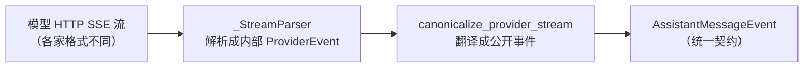
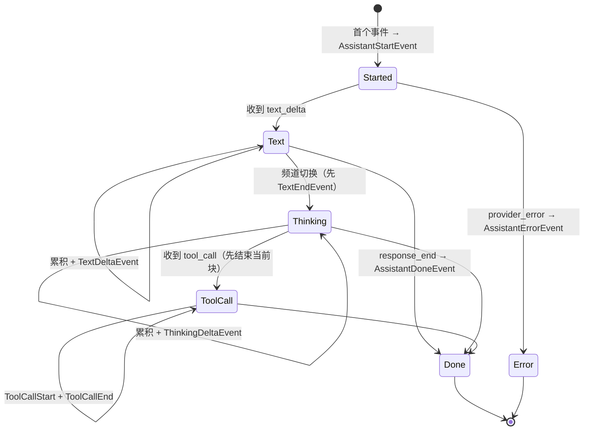
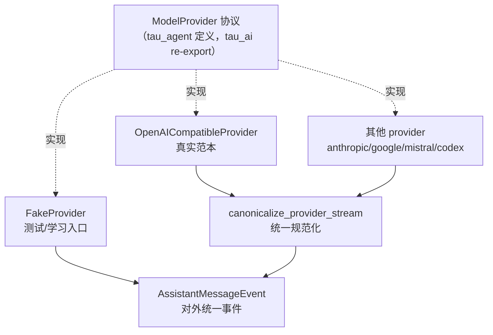

# AI 层手册：`tau_ai`

> 本篇逐文件精读 `src/tau_ai/`。这是三层中**最简单**的一层，也是建议**第一个啃完**的实现层。
>
> 一句话职责：**把各家大模型五花八门的流式 HTTP 输出，收拢成一套统一的 `AssistantMessageEvent` 事件流。**

## 阅读顺序建议

```text
provider.py（契约）
  → fake.py（最简实现，先看它！）
  → _provider_events.py（内部中间事件）
  → stream.py（规范化状态机，核心）
  → openai_compatible.py（真实实现）
  → env.py / retry.py / http.py / http_errors.py / content.py / model_limits.py（基础设施）
```

---

## 一、层内整体设计

`tau_ai` 的每个 provider 适配器都做同一件事：



- **内部事件**（`_provider_events.py` 的 `ProviderEvent`）：私有的、每个 provider 内部用的中间表示（文本增量、思考增量、工具调用、开始/结束/错误/重试）。
- **公开事件**（`AssistantMessageEvent`，其实定义在 `tau_agent`）：对外统一契约，带 `partial`（当前累积的助手消息快照）。

> 关键设计：provider 适配器**先**把 HTTP 流解析成内部 `ProviderEvent`，**再**用 `canonicalize_provider_stream` 统一翻译成公开事件。provider 各自的差异被隔离在"解析器"里，公开的事件形状永远一致。

---

## 二、`__init__.py`——公共门面

`tau_ai/__init__.py` 是这一层的"公开导出清单"，它把以下东西暴露给 `tau_coding` 使用：

- 各 provider 类：`AnthropicProvider`、`OpenAICompatibleProvider`、`GoogleGenerativeAIProvider`、`MistralConversationsProvider`、`OpenAICodexProvider`、`FakeProvider`。
- 配置类：`OpenAICompatibleConfig`、`AnthropicConfig`、`OpenAICodexConfig` 等，以及 `openai_compatible_config_from_env`。
- 事件类型：`AssistantStartEvent`、`TextDeltaEvent`、`ToolCallEndEvent` 等（全部 re-export 自 `tau_agent`）。
- 协议：`ModelProvider`、`CancellationToken`（也 re-export 自 `tau_agent`）。
- 模型限制：`ModelLimitsProvider`、`RuntimeModelLimits`。

最后一行 `__all__ = [name for name in globals() if not name.startswith("_")]` 是一个惯用法：自动导出所有不以下划线开头的名字。

---

## 三、`provider.py` 与 `events.py`——只是 re-export

这两个文件短到只有几行，但**概念上极其重要**：

```python
# tau_ai/provider.py 全文
from tau_agent.provider import CancellationToken, ModelProvider
__all__ = ["CancellationToken", "ModelProvider"]
```

```python
# tau_ai/events.py 全文（节选）
from tau_agent.provider_events import (
    AssistantDoneEvent, AssistantErrorEvent, AssistantMessageEvent,
    TextDeltaEvent, ToolCallEndEvent, ...
)
```

**含义**：AI 层的"契约"其实归 Agent 层所有。这是为了保证：

1. 单向依赖成立（`tau_ai → tau_agent`）。
2. 核心大脑 `tau_agent` 只认识 `ModelProvider` 协议，不认识任何具体家的模型。
3. 任何人都能实现 `ModelProvider` 协议，无需改动 `tau_agent`。

### `ModelProvider` 协议（定义在 `tau_agent/provider.py`）

```python
class ModelProvider(Protocol):
    def stream_response(
        self, *,
        model: str,
        system: str,
        messages: list[AgentMessage],
        tools: list[AgentTool],
        signal: CancellationToken | None = None,
    ) -> AsyncIterator[AssistantMessageEvent]:
        ...
```

只有**一个方法**：给定模型、系统提示、消息历史、工具集，返回一个"助手消息事件"的异步迭代器。这就是整个 AI 层要满足的全部接口。

### `CancellationToken` 协议

```python
class CancellationToken(Protocol):
    def is_cancelled(self) -> bool: ...
```

只有一个 `is_cancelled()`，用于用户按 Ctrl+C / 取消时提前终止流。

---

## 四、`fake.py`——理解一切的钥匙（先看它）

`FakeProvider` 是最小的 `ModelProvider` 实现，**建议第一个读**。它不联网，只回放预设好的事件流：

```python
class FakeProvider:
    def __init__(self, streams: Iterable[Iterable[AssistantMessageEvent]]) -> None:
        self._streams = [list(stream) for stream in streams]
        self.calls = []  # 记录每次被调用时的参数，方便测试断言

    def stream_response(self, *, model, system, messages, tools, signal=None):
        self.calls.append((model, system, list(messages), list(tools)))
        stream = self._streams.pop(0) if self._streams else []

        async def iterator():
            for event in stream:
                if signal is not None and signal.is_cancelled():
                    return
                yield event
        return iterator()
```

要点：

- 构造时传入"一组事件流"，每次 `stream_response` 调用消费其中一条（`pop(0)`）。为什么是"一组"？因为一次对话可能有多轮（模型 → 工具 → 模型 → ...），每轮都会调一次 `stream_response`。
- 它把调用参数记进 `self.calls`，测试里可以断言"第二轮确实带上了工具结果"。
- 它也检查 `signal.is_cancelled()`，演示 provider 应如何响应取消。

**理解 `FakeProvider` = 理解 `ModelProvider` 契约。** 后面所有真实 provider 都只是"把 HTTP 流变成同样的事件流"。

---

## 五、`_provider_events.py`——内部中间事件

这里定义 7 种私有事件（`ProviderEvent` 联合类型），都是 pydantic `BaseModel`、`extra="forbid"`：

| 事件 | 含义 |
| --- | --- |
| `ProviderResponseStartEvent` | 模型开始响应（带 `model`） |
| `ProviderRetryEvent` | 适配器正在重试瞬时失败（带 attempt、delay） |
| `ProviderTextDeltaEvent` | 一段文本增量（`delta`） |
| `ProviderThinkingDeltaEvent` | 一段思考/推理增量（`delta`） |
| `ProviderToolCallEvent` | 一个完整的工具调用（`tool_call`） |
| `ProviderResponseEndEvent` | 响应结束（带完整 `message` 和 `finish_reason`） |
| `ProviderErrorEvent` | provider 级错误（`message` + `data`） |

这些**不对外暴露**，仅供 provider 内部解析器 → `stream.py` 之间传递。

---

## 六、`stream.py`——规范化状态机（核心）

`canonicalize_provider_stream()` 是这一层最需要动脑的地方。它消费内部 `ProviderEvent`，产出公开 `AssistantMessageEvent`。核心是维护一个"正在累积的助手消息" `partial` 和一个"当前活动块"游标：

```python
async def canonicalize_provider_stream(source, *, api, provider, model):
    partial = AssistantMessage(api=api, provider=provider, model=model)
    active_index = None     # 当前正在写的 content 块下标
    active_kind = None      # "text" 或 "thinking"
    started = False
    terminal = False
    async for event in source:
        ...
```

它把内部事件翻译成如下公开事件序列（每种块都遵循 start → delta... → end）：



关键行为（都能在源码中逐条对上）：

1. **频道切换会先结束旧块**：`_end_active_block` 在从 text 切到 thinking（或遇到工具调用）时，先发一个 `TextEndEvent`/`ThinkingEndEvent`。
2. **每个事件都带 `partial` 快照**：`_snapshot()` 用 `model_copy(deep=True)` 深拷贝当前累积消息，让消费者（UI）随时能拿到"到目前为止的完整消息"。
3. **`response_end` 时以流式顺序为准**：最终消息的 `content` 用流式累积的块，provider 的最终消息只保留元数据/usage（见 `final.content = [...]` 那段）。
4. **`_finish_reason` 归一化**：把各家的 `tool_calls`/`tool_use`/`length`/`max_tokens` 等映射成统一的 `stop`/`length`/`toolUse`。
5. **兜底**：如果流结束时没有终止事件，补一个 `AssistantErrorEvent`（"Provider stream ended without a terminal event"）。`ProviderRetryEvent` 在这一层被直接忽略（`continue`），因为重试是 provider 内部的事。

> **教学要点**：把 `stream.py` 看作"翻译官 + 打字机"。它一边把内部事件翻译成对外事件，一边像打字机一样把字符追加到 `partial` 上，让上层能实时渲染。

---

## 七、`openai_compatible.py`——真实实现范本（最重要的适配器）

这是最有代表性的真实 provider，支持所有"OpenAI 兼容"接口（包括本地模型）。文件较长，抓住三个层次：

### 7.1 顶层：`OpenAICompatibleProvider.stream_response`

```python
def stream_response(self, *, model, system, messages, tools, signal=None):
    raw = self._stream_provider_events(...)     # → 内部 ProviderEvent 流
    return canonicalize_provider_stream(        # → 公开 AssistantMessageEvent 流
        raw, api=self._config.api,
        provider=getattr(self._config, "provider_name", "openai-compatible"),
        model=model,
    )
```

清晰的两段式：先产内部事件流，再规范化。

### 7.2 两条 API 路径：`/chat/completions` vs `/v1/responses`

`_stream_provider_events` 根据模型选择端点：

```python
def _use_responses_api(model: str) -> bool:
    normalized = model.strip().lower()
    if "codex" in normalized:
        return True
    return any(normalized.startswith(p) for p in ("gpt-5.5", "gpt-5.4"))
```

- 普通模型走 `/chat/completions`，用 `_ChatStreamParser`。
- 新推理模型（codex 家族、gpt-5.4/5.5）走 `/v1/responses`，用 `_ResponsesStreamParser`（因为这些模型在 chat 端点上拒绝"函数工具 + reasoning_effort"组合）。

### 7.3 共享的流式外壳：`_stream()`

`_stream()` 把两个端点共同的部分抽出来（**这段体现了良好的抽象取舍**）：

- 构造 HTTP client、拼 `Authorization` header（除非 `omit_authorization_header`）。
- 支持 `credential_resolver`（OAuth 场景请求前动态解析凭据）。
- `client.stream("POST", ...)` 发起 SSE 流式请求。
- 状态码 >= 400 时，判断是否可重试（`_should_retry` + `_is_transient_status`：408/409/425/429/5xx）；可重试就发 `ProviderRetryEvent` 并退避等待，否则发 `ProviderErrorEvent`。
- 逐行读 SSE（`_parse_sse_line` 提取 `data:` 后的内容），交给 `parser.feed()`。
- 每行都检查 `signal.is_cancelled()` 以支持取消。
- 网络异常（`httpx.HTTPError`）且尚未产出内容时也会重试。

端点差异（如何解析 SSE chunk、如何组装最终消息）则放在各自的 `_StreamParser` 里。这是一个"模板方法"式设计：**外壳统一，差异下沉到解析器**。

### 7.4 两个解析器

- **`_ChatStreamParser`**：解析 `/chat/completions` 的 chunk。累积 `content`（文本）、`reasoning_content`/`reasoning`/`thinking`（思考）、`tool_calls`（用 `_ToolCallBuilder` 按 index 拼接流式工具参数）。遇到 `[DONE]` 结束。`finalize()` 组装成 `ProviderResponseEndEvent`。
- **`_ResponsesStreamParser`**：解析 `/v1/responses` 的事件（有类型的 SSE，如 `response.output_text.delta`、`response.function_call_arguments.delta`、`response.completed` 等）。没有 `[DONE]`，靠 `response.completed`/`response.incomplete`/`response.failed` 终止。

### 7.5 消息 → provider 载荷的转换

- `_messages_to_openai_chat`：把 Tau 的 `AgentMessage` 列表转成 OpenAI chat messages（user/assistant/tool 角色，处理多模态图片、把 `ThinkingContent` 放回 `reasoning_content` 等）。
- `_tool_to_openai`：把 `AgentTool` 转成 OpenAI function tool schema（`{"type":"function","function":{name,description,parameters}}`）。
- `_build_chat_payload` / `_build_responses_payload`：组装最终请求体，处理 `reasoning_effort`、`max_tokens`、`stream_options` 等各种兼容开关（`compat` 字典驱动，支持 zai/qwen/deepseek/openrouter/together 等厂商差异）。
- `_parse_chunk_usage` / `_usage_from_responses_event`：解析 token usage（缓存读/写、reasoning tokens），注释里明确写了"Tau 没有定价表，所以 cost 留空"。

> **教学要点**：真实 provider = `stream_response`（两段式）+ `_stream`（统一外壳）+ 两个 parser（差异）+ 一堆纯函数（消息/工具/usage 转换）。看完这一个，其余的 `anthropic.py`/`google.py`/`mistral.py` 都是同样的套路，只是换了 HTTP 格式。

---

## 八、其余 provider 适配器（同构，简要）

| 文件 | 对接 | 特点 |
| --- | --- | --- |
| `anthropic.py` | Anthropic Messages API | 支持 prompt caching（`cache_retention`）、thinking budget、OAuth（Claude Code 身份） |
| `google.py` | Google Generative AI | 复用 `OpenAICompatibleConfig`，走 `google-generative-ai` api |
| `mistral.py` | Mistral Conversations | 同上，走 `mistral-conversations` api |
| `openai_codex.py` | OpenAI Codex 订阅 | OAuth + account_id，用 `/v1/responses`，有专门的 `OpenAICodexCredentials` |

它们都实现同一个 `ModelProvider.stream_response` 协议，都最终经过 `canonicalize_provider_stream`。

---

## 九、基础设施文件

### `env.py`——配置数据类 + 从环境变量读取

- `OpenAICompatibleConfig` / `AnthropicConfig`：`frozen=True` 的配置 dataclass，字段包括 `api_key`、`base_url`、`timeout_seconds`、`max_retries`、`supports_images`、`reasoning_effort`、`compat`、`credential_resolver` 等。
- `openai_compatible_config_from_env()`：读 `OPENAI_API_KEY`（缺则抛 `RuntimeError`）、`OPENAI_BASE_URL`、超时/重试等环境变量。
- `RuntimeProviderAuth`：请求前动态解析出的凭据（api_key + base_url + headers），OAuth 场景用。

### `retry.py`——退避重试

- `retry_delay_seconds(attempt, max_delay_seconds)`：指数退避（base 0.25s × 2^attempt，封顶）。
- `provider_retry_event(...)`：构造对用户可读的重试进度事件。
- `wait_for_retry(delay, signal)`：分片睡眠（每 0.05s 检查一次取消），退避期间也能被 Ctrl+C 打断。

### `http.py`——HTTP client 工厂 + 代理归一化

- `create_async_client(**kwargs)`：创建 `httpx.AsyncClient`，同时归一化代理环境变量。
- `normalize_proxy_url` / `normalized_proxy_environment`：把 `socks://` 归一成 `socks5://`（httpx 不认前者）。
- `get_json(url, timeout)`：同步 GET JSON（如模型列表探测）。

> **安全提示**（对应安全铁律 SSRF 项）：`http.py` 不做内网域名拦截。如果你二次开发时允许模型/工具请求任意 URL，需要自己在调用点加内网访问校验。

### `http_errors.py`——安全的错误信息提取

- `provider_http_error_message(...)`：把 HTTP 错误体解析成简洁、**不含密钥**的错误提示（截断到 1000 字符）。这体现了"错误信息不泄露 secret"的安全考量。

### `content.py`——多模态内容处理

- `messages_have_images(messages)`：判断上下文里是否含图片块。
- `text_and_images(content, supports_images, image_placeholder)`：把内容拆成"可见文本 + 可发送图片"；当模型不支持视觉时，用占位符文本降级，避免把无法理解的图片喂给模型。

### `model_limits.py`——运行时模型限制（可选能力）

- `RuntimeModelLimits`：`context_window`、`max_output_tokens`、有效上下文百分比、自动压缩阈值，带校验和 `effective_*` 计算属性。
- `ModelLimitsProvider`（`runtime_checkable` Protocol）：provider 可选实现 `discover_model_limits(model)`，让 Tau 拿到真实上下文窗口用于 token 统计和自动压缩。

---

## 十、本层小结



- **一个协议**（`stream_response`）+ **一个规范化状态机**（`canonicalize_provider_stream`）+ **N 个解析器**，就是整个 AI 层。
- 差异被隔离在 provider 内部，对上永远是同一套事件。
- 想接新模型？只要写一个满足 `ModelProvider` 协议的类即可（见 `05` 拓展篇）。

下一篇：`02-Agent层手册-tau_agent.md`（项目核心）。
