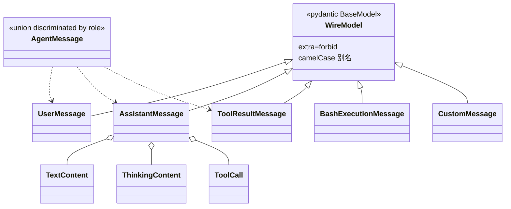
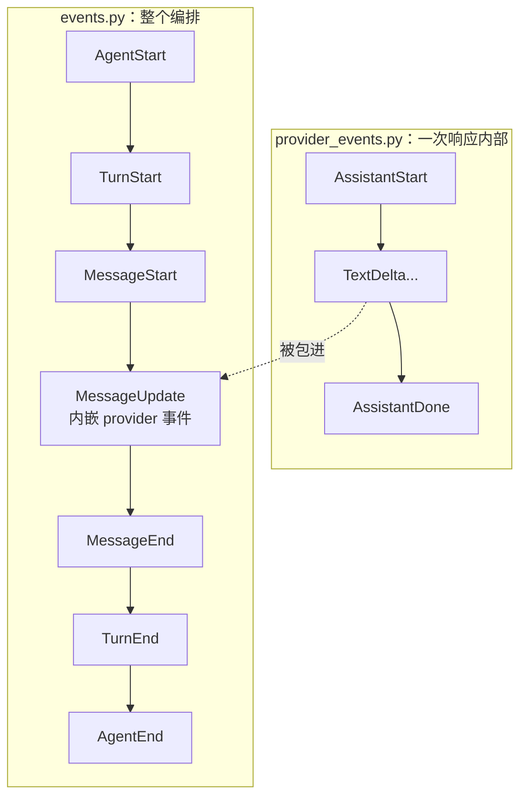
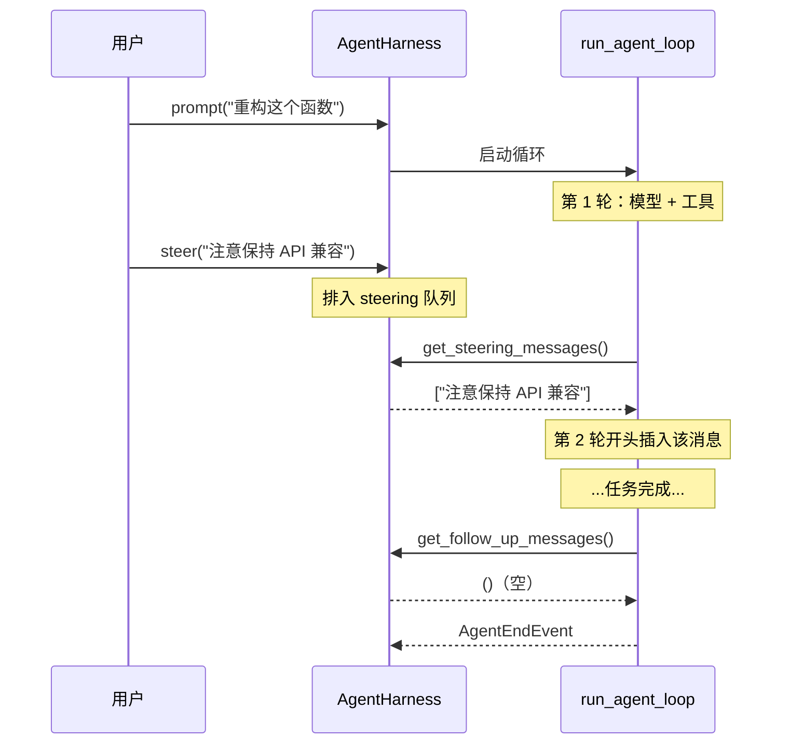
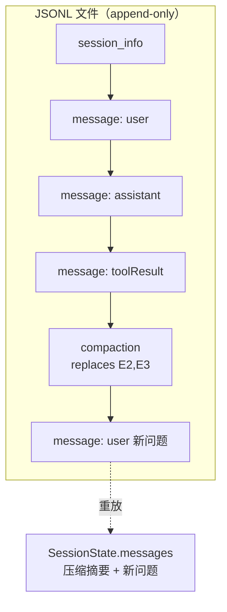
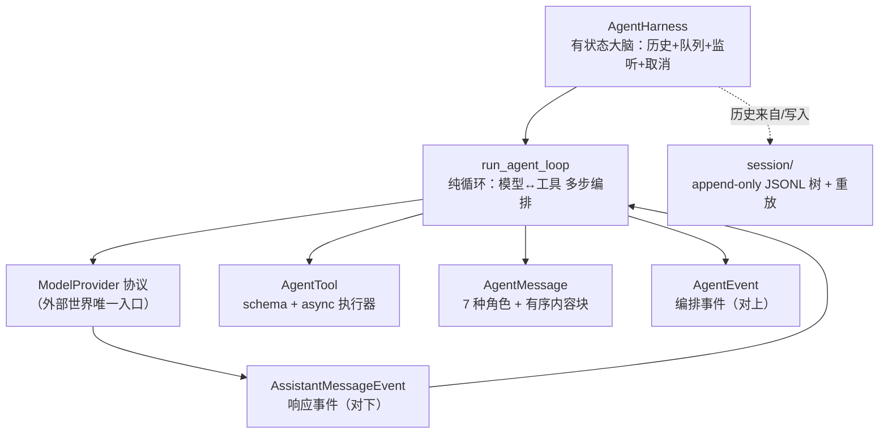

# Agent 层手册：`tau_agent`（项目核心）

> 本篇逐文件精读 `src/tau_agent/`。这是**整个项目的心脏**——可复用的"Agent 大脑"。它不认识终端、不认识 Rich/Textual、不认识文件路径，只认识：消息、工具、事件、循环、会话。
>
> 一句话职责：**用最小化的抽象，实现 Agent 循环、消息队列、工具调用、事件分发、会话持久化。**

## 阅读顺序建议

```text
types.py（JSON 类型）
  → messages.py（消息模型，地基）
  → provider_events.py（provider 级事件）
  → events.py（agent 级事件）
  → tools.py（工具协议）
  → provider.py（provider 协议）
  → loop.py（run_agent_loop 循环，核心！）
  → harness.py（AgentHarness 状态封装）
  → session/（会话持久化）
```

---

## 一、`__init__.py`——公共门面

`tau_agent/__init__.py` 导出这一层所有公开 API，分五组：

- **事件**：`AgentEvent` 及其成员（`AgentStartEvent`、`TurnStartEvent`、`MessageUpdateEvent`、`ToolExecutionEndEvent`...）。
- **大脑**：`AgentHarness`、`AgentHarnessConfig`、`EventListener`、`QueuedMessages`、`SimpleCancellationToken`、`run_agent_loop`。
- **消息**：`AgentMessage`、`AssistantMessage`、`UserMessage`、`ToolCall`、`ToolResultMessage`、`TextContent`、`ThinkingContent`、`ImageContent`、`Usage` 等，以及辅助函数 `content_text`、`message_text`。
- **会话**：`JsonlSessionStorage`、`SessionState`、各种 `*Entry`。
- **工具**：`AgentTool`、`AgentToolResult`、`ToolExecutor`、`ToolExecutionMode` 等。

README 里"把 Tau 当库用"的例子就是直接从这里 import：

```python
from tau_agent import AgentHarness, AgentHarnessConfig

harness = AgentHarness(AgentHarnessConfig(
    provider=provider, model="my-model",
    system="You are a helpful coding agent.", tools=tools,
))
async for event in harness.prompt("Explain this package"):
    print(event)
```

---

## 二、`types.py`——JSON 类型别名

极短，用 PEP 695 定义递归 JSON 类型：

```python
type JSONPrimitive = str | int | float | bool | None
type JSONValue = JSONPrimitive | list[JSONValue] | dict[str, JSONValue]
type JSONObject = dict[str, JSONValue]
```

工具参数、工具结果 details 都用 `JSONValue`，保证可序列化。

---

## 三、`messages.py`——消息模型（全项目地基）

这是**最该先吃透**的文件。所有消息都继承 `WireModel`：

### 3.1 `WireModel`——统一的 pydantic 基类

```python
class WireModel(BaseModel):
    model_config = ConfigDict(
        extra="forbid",           # 拒绝未知字段（严格）
        validate_by_name=True,
        validate_by_alias=True,
        serialize_by_alias=True,  # 序列化用别名
        alias_generator=_to_camel # Python snake_case ↔ JSON camelCase
    )
```

`_to_camel` 把 `tool_call_id` 这类 Python 字段名转成 JSON 里的 `toolCallId`。**Python 侧用蛇形、线上协议用驼峰**，两边都能校验。这就是 README 说的"Pi 兼容的 JSON wire shape"。

### 3.2 内容块（Content Blocks）

助手消息由**有序的内容块**组成：

| 块类型 | 字段 | 说明 |
| --- | --- | --- |
| `TextContent` | `text`、`text_signature?` | 可见文本 |
| `ThinkingContent` | `thinking`、`thinking_signature?`、`redacted` | 思考/推理 |
| `ImageContent` | `data`（base64）、`mime_type` | 图片 |
| `ToolCall` | `id`、`name`、`arguments`、`thought_signature?` | 一次工具调用请求 |

### 3.3 消息类型（7 种角色，`AgentMessage` 联合）

```python
type AgentMessage = Annotated[
    UserMessage | AssistantMessage | ToolResultMessage
    | BashExecutionMessage | CustomMessage
    | BranchSummaryMessage | CompactionSummaryMessage,
    Field(discriminator="role"),   # 用 role 字段区分
]
```

| 消息 | role | 关键字段 | 用途 |
| --- | --- | --- | --- |
| `UserMessage` | `user` | `content`（str 或块列表） | 用户输入 |
| `AssistantMessage` | `assistant` | `content`（块列表）、`usage`、`stop_reason`、`api/provider/model` | 模型回复 |
| `ToolResultMessage` | `toolResult` | `tool_call_id`、`tool_name`、`content`、`is_error` | 工具执行结果 |
| `BashExecutionMessage` | `bashExecution` | `command`、`output`、`exit_code` | 终端命令记录 |
| `CustomMessage` | `custom` | `custom_type`、`content`、`display` | 扩展/应用自定义消息 |
| `BranchSummaryMessage` | `branchSummary` | `summary`、`from_id` | 分支回溯摘要 |
| `CompactionSummaryMessage` | `compactionSummary` | `summary`、`tokens_before` | 上下文压缩摘要 |

### 3.4 便利属性与函数

- `AssistantMessage.text` / `.thinking_text` / `.tool_calls`：从内容块里提取纯文本 / 思考 / 工具调用元组。
- `_normalize_convenient_content`（`@model_validator(mode="before")`）：允许你写 `AssistantMessage(content="hello")`，它自动转成 `[TextContent(text="hello")]`。**存储和协议永远是块列表**，字符串只是构造便利。
- `assistant_content(text, tool_calls)`：从"文本 + 工具调用"拼出有序块列表（provider 解析器用）。
- `content_text` / `message_text` / `message_to_user`：跨消息类型提取可见文本、把自定义/会话消息降级成 `UserMessage`（喂给不认识这些角色的 provider）。



---

## 四、两套事件——最容易混的地方

Tau 有**两层事件**，务必分清：

### 4.1 `provider_events.py`——Provider 级事件（`AssistantMessageEvent`）

描述"**一次模型响应内部**"发生了什么，由 provider 产出、被 loop 消费：

| 事件 | 说明 |
| --- | --- |
| `AssistantStartEvent` | 响应开始（带 `partial`） |
| `TextStartEvent` / `TextDeltaEvent` / `TextEndEvent` | 文本块的开始/增量/结束 |
| `ThinkingStartEvent` / `ThinkingDeltaEvent` / `ThinkingEndEvent` | 思考块 |
| `ToolCallStartEvent` / `ToolCallDeltaEvent` / `ToolCallEndEvent` | 工具调用块 |
| `AssistantDoneEvent` | 响应正常结束（带 `reason`：stop/length/toolUse + 完整 `message`） |
| `AssistantErrorEvent` | 响应出错（带 `reason`：aborted/error） |

每个事件（除终止事件）都带 `partial`（当前累积的助手消息快照）。这就是 `01` 篇里 `stream.py` 产出的东西。

### 4.2 `events.py`——Agent 级事件（`AgentEvent`）

描述"**整个 Agent 编排过程**"发生了什么，由 `run_agent_loop` 产出、被 UI/渲染器消费：

| 事件 | 说明 |
| --- | --- |
| `AgentStartEvent` / `AgentEndEvent` | 整个 prompt 处理的开始/结束（`AgentEndEvent` 带本轮新增的 `messages`） |
| `TurnStartEvent` / `TurnEndEvent` | 单轮（一次"模型响应 + 工具执行"）的开始/结束 |
| `MessageStartEvent` / `MessageEndEvent` | 一条消息的开始/结束（消息可以是 user/assistant/toolResult...） |
| `MessageUpdateEvent` | 消息流式更新（**内嵌**一个 provider 级 `assistant_message_event`） |
| `ToolExecutionStartEvent` / `ToolExecutionUpdateEvent` / `ToolExecutionEndEvent` | 工具执行的开始/进度/结束 |

> **关键关系**：`MessageUpdateEvent` 是"桥"——它把 provider 级事件包进 agent 级事件（`assistant_message_event` 字段）。UI 既能看到粗粒度的 agent 编排（哪轮、哪条消息、哪个工具），也能看到细粒度的流式增量。



---

## 五、`tools.py`——工具协议

工具在 Tau 里就是"**一个 schema + 一个 async 执行器**"。

### 5.1 `AgentTool`（frozen dataclass）

```python
@dataclass(frozen=True, slots=True)
class AgentTool:
    name: str
    label: str
    description: str
    parameters: Mapping[str, JSONValue]   # JSON Schema
    execute_fn: ToolExecutor              # async 执行函数
    prompt_snippet: str | None = None     # 给系统提示用的一句话
    prompt_guidelines: tuple[str, ...] = ()
    prepare_arguments: ToolArgumentPreparer | None = None
    execution_mode: ToolExecutionMode = "parallel"
    render_call / render_result: ...      # 前端渲染钩子（可选）

    async def execute(self, tool_call_id, arguments, signal=None, on_update=None):
        return await self.execute_fn(tool_call_id, arguments, signal, on_update)
```

### 5.2 `AgentToolResult`

```python
class AgentToolResult(WireModel):
    content: list[TextContent | ImageContent]   # 结果内容
    details: JSONValue = None                    # 结构化附加数据
    added_tool_names: list[str] | None = None    # 动态新增的工具
    terminate: bool | None = None                # 是否请求终止 agent
```

支持 `AgentToolResult(content="ok")` 便利写法（同样自动转块）。

### 5.3 关键协议

- `ToolExecutor`：`(tool_call_id, arguments, signal?, on_update?) -> Awaitable[AgentToolResult]`。
- `ToolUpdateCallback`：工具执行中途上报进度（`on_update(partial_result)`），用于流式展示长任务。
- `ToolCancellationToken`：`is_cancelled()`，工具应主动检查以支持取消。

> **教学要点**：工具与具体前端 / 文件系统无关。`tau_agent` 只定义"工具长什么样、怎么调用"，真正的 `read`/`write`/`edit`/`bash` 实现在 `tau_coding/tools.py`（见 `03` 篇）。

---

## 六、`provider.py`——Provider 协议

已在 `01` 篇讲过：只有 `stream_response` 一个方法 + `CancellationToken` 协议。这里再强调它在 Agent 层的位置——它是 loop 唯一的"外部世界入口"。

---

## 七、`loop.py`——`run_agent_loop`（**全项目最核心的函数**）

这个异步生成器函数实现了完整的 Agent 循环。它是"纯"的：只依赖 `ModelProvider` 协议和 `AgentTool`，产出 `AgentEvent`。

### 7.1 函数签名

```python
async def run_agent_loop(
    *, provider, model, system, messages, tools,
    prompts=(),                      # 本次要追加的用户消息
    max_turns=None,
    signal=None,
    get_steering_messages=None,      # 拉取"引导消息"（本轮末尾插入）
    get_follow_up_messages=None,     # 拉取"追问消息"（agent 收尾后继续）
    before_tool_call=None,           # 工具调用前钩子（审批/拦截）
    after_tool_call=None,            # 工具调用后钩子（改写结果）
) -> AsyncIterator[AgentEvent]:
```

### 7.2 循环结构（伪代码贴合源码）

```text
发 AgentStartEvent、TurnStartEvent
把 prompts 追加进 messages，逐条发 MessageStart/MessageEnd

while True:                          # 外层：处理 follow-up
    has_more_tools = True
    while has_more_tools or pending: # 内层：一轮接一轮
        （非首轮）发 TurnStartEvent
        把 pending（steering）消息插入 messages
        若超过 max_turns → 发错误消息并结束

        # 1) 调模型，消费 provider 事件流
        assistant = None
        async for event in _assistant_events(provider, model, system,
                                             _provider_context(messages), tools, signal):
            yield event                      # 转发给上层（含 MessageUpdate 流式）
            if 是 MessageEnd 且是 AssistantMessage:
                assistant = event.message    # 记住这轮的助手消息

        messages.append(assistant)
        若 assistant.stop_reason in {error, aborted}:
            发 TurnEnd、AgentEnd，结束

        # 2) 执行助手请求的所有工具调用
        calls = assistant.tool_calls
        has_more_tools = bool(calls)
        for call in calls:
            async for event in _execute_tool_call(call, tool_by_name, signal,
                                                   before_tool_call, after_tool_call):
                yield event
                if 是 ToolResult 的 MessageEnd:
                    收集进 tool_results 和 messages

        发 TurnEndEvent(assistant, tool_results)
        turn += 1
        pending = get_steering_messages()    # 本轮末尾拉取引导消息

    follow_ups = get_follow_up_messages()
    若有 → pending = follow_ups，continue    # 用户在 agent 结束后又追问
    否则 break

发 AgentEndEvent(new_messages)
```

### 7.3 三个关键点

**(1) 什么时候停？** 内层 while 的条件是 `has_more_tools or pending`：

- 模型这轮**没请求工具** → `has_more_tools = False` 且没有 pending → 跳出内层 → 若没有 follow-up 就结束。
- 模型这轮**请求了工具** → 执行工具 → `has_more_tools=True` → 继续下一轮（把工具结果喂回模型）。

这就是 Agent"自主多步"的本质：**只要模型还在调工具，就继续循环**。

**(2) `_assistant_events`——provider 事件 → agent 事件**

```python
async def _assistant_events(...):
    source = provider.stream_response(...)
    started = False
    async for event in source:
        if isinstance(event, AssistantStartEvent):
            started = True
            yield MessageStartEvent(message=event.partial)
        elif isinstance(event, AssistantDoneEvent):
            yield MessageEndEvent(message=event.message)
        elif isinstance(event, AssistantErrorEvent):
            yield MessageEndEvent(message=event.error)
        else:
            yield MessageUpdateEvent(message=event.partial,
                                     assistant_message_event=event)
```

它把 `01` 篇的 provider 事件"升维"成 agent 事件：start→MessageStart，done→MessageEnd，其余增量→MessageUpdate（内嵌原事件）。

**(3) `_execute_tool_call`——工具执行**

```python
async def _execute_tool_call(call, tools, signal, before, after):
    yield ToolExecutionStartEvent(...)
    # 前置钩子：可拦截
    if before: blocked, reason = await before(call)
    if blocked: result = 错误结果
    elif signal.is_cancelled(): result = "Operation aborted"
    else:
        tool = tools.get(call.name)
        if tool is None: result = "Tool not found"
        else: result, is_error, updates = await _run_tool(tool, call, signal)
              for update in updates: yield ToolExecutionUpdateEvent(...)
    # 后置钩子：可改写结果
    if after: result, is_error = await after(call, result, is_error)
    yield ToolExecutionEndEvent(result=result, is_error=is_error)
    # 生成 ToolResultMessage
    yield MessageStartEvent(message); yield MessageEndEvent(message)
```

- `_run_tool` 用 try/except **包住工具**：工具抛异常不会崩溃循环，而是变成 `is_error=True` 的结果（"工具是隔离边界"）。
- `before_tool_call` / `after_tool_call` 是**权限/审批的挂载点**——`tau_coding` 就是在这里实现"危险命令需用户批准"（见 `03` 篇）。

**(4) `_provider_context`——不把脏消息喂给模型**

```python
def _provider_context(messages):
    # 过滤掉"内容为空的失败/中断助手消息"
    return [m for m in messages if not (
        isinstance(m, AssistantMessage)
        and m.stop_reason in {"error", "aborted"}
        and not m.content
    )]
```

失败的空助手轮会**持久化**（用于诊断），但**不会**作为上下文发给下一次请求（否则很多 provider 会拒绝空助手轮）。

---

## 八、`harness.py`——`AgentHarness`（有状态的大脑封装）

`run_agent_loop` 是纯函数；`AgentHarness` 在它外面加上**状态**：消息历史、事件监听、取消、消息队列。

### 8.1 `AgentHarnessConfig`

```python
@dataclass(slots=True)
class AgentHarnessConfig:
    provider: ModelProvider
    model: str
    system: str
    tools: list[AgentTool] = []
    max_turns: int | None = None
    queue_mode: QueueMode = "one_at_a_time"   # 或 "all"
    before_tool_call / after_tool_call = None
```

### 8.2 核心能力

| 方法/属性 | 作用 |
| --- | --- |
| `prompt(content)` / `prompt_message(msg)` | 发起一次新提问，返回事件异步迭代器 |
| `continue_()` | 不加新消息，继续跑（用于 resume） |
| `messages` | 只读的当前消息历史（tuple） |
| `append_message` / `replace_messages` | 直接改历史（resume/压缩时用） |
| `subscribe(listener)` | 注册事件监听器，返回退订函数 |
| `cancel()` | 取消当前运行（触发 `SimpleCancellationToken`） |
| `steer(content)` / `steer_message` | 排入"引导消息"（当前轮末尾插入） |
| `follow_up(content)` / `follow_up_message` | 排入"追问消息"（agent 收尾后继续） |
| `is_running` / `queued_messages` / `pending_message_count` | 运行状态 & 队列观测 |

### 8.3 消息队列机制（steering vs follow-up）

这是 Tau 交互体验的关键：**用户可以在 agent 正在跑的时候插话**。

- **steering（引导）**：在**当前**多步任务的下一轮开头插入，用于"纠偏"。`get_steering_messages` 被 loop 在每轮末尾调用。
- **follow-up（追问）**：等 agent 把当前任务**做完收尾后**再作为新一轮继续。`get_follow_up_messages` 在外层 while 检查。
- `queue_mode`：`one_at_a_time`（每次取一条）或 `all`（一次取空整个队列）。`_drain_queue` 实现两种策略。



### 8.4 中断恢复：`_append_interrupted_tool_results`

如果用户在工具执行中途取消，助手消息里会有"没有对应结果"的工具调用。下次 `prompt`/`continue_` 前，harness 自动为这些悬空调用补上 `ToolResultMessage`（内容 "Tool call interrupted by user"、`is_error=True`），保证消息序列对 provider 合法。

---

## 九、`session/`——会话持久化（append-only 树）

会话存储是**追加式（append-only）**的：只往文件尾部加条目，从不改写历史。当前状态由"重放所有条目"算出。

### 9.1 `entries.py`——条目模型

所有条目继承 `BaseSessionEntry`（有 `id`、`parent_id`、`timestamp`），用 `type` 区分：

| 条目 | 作用 |
| --- | --- |
| `MessageEntry` | 一条消息（`message: AgentMessage`） |
| `ModelChangeEntry` | 切换了模型 |
| `ThinkingLevelChangeEntry` | 切换了思考等级 |
| `CompactionEntry` | 压缩摘要（`summary` + `replaces_entry_ids`：它替换了哪些旧条目） |
| `BranchSummaryEntry` | 分支回溯摘要 |
| `LabelEntry` | 人类可读标签 |
| `LeafEntry` | 当前活动分支的叶子指针 |
| `SessionInfoEntry` | 会话元信息（cwd、title、created_at） |
| `CustomEntry` | 扩展/应用自定义数据（带 `namespace`） |

**`parent_id` 让条目形成一棵树**——这是分支功能的基础。

### 9.2 `tree.py`——树遍历

- `entries_by_id`：按 id 建索引，拒绝重复 id。
- `path_to_entry(entries, leaf_id)`：从某个叶子沿 `parent_id` 一路回溯到根，得到"根→叶"的路径（带环检测、缺失检测）。

### 9.3 `memory.py`——`SessionState.from_entries`（重放）

把条目列表"重放"成当前状态：

```python
@dataclass(frozen=True, slots=True)
class SessionState:
    messages: tuple[AgentMessage, ...]
    model / thinking_level / label / active_leaf_id
    session_info / custom_entries / compaction_entries
    context_entry_ids / entries
```

重放逻辑（`match entry.type`）：

- `message` → 加入消息列表（记住 entry_id）。
- `model_change` / `thinking_level_change` / `label` / `leaf` / `session_info` / `custom` → 更新对应状态。
- `compaction` → 调 `_apply_compaction`：把 `replaces_entry_ids` 里的旧消息替换成一条压缩摘要 `UserMessage`（"Previous conversation summary: ..."）。
- `branch_summary` → 插入一条分支摘要 `UserMessage`。

传入 `leaf_id` 时只重放"根→该叶"的路径（`path_to_entry`），这样切换分支就是"换一个叶子重放"。



### 9.4 `jsonl.py`——序列化 + 历史迁移

- `entry_to_json_line` / `entry_from_json_line` / `entries_from_json_lines`：用 pydantic `TypeAdapter` 做 JSONL 序列化/反序列化。
- `_migrate_session_entry` / `_migrate_message`：**历史迁移**。老版本（Tau v1）的持久化消息格式（如 `role="tool"`、字符串 content、旧的 `tool_calls` 字段）在读取时被就地迁移成当前规范。注释点明设计意图：**运行时模型保持单一严格协议，迁移只发生在持久化边界**。

### 9.5 `storage.py`——存储协议 + JSONL 实现

- `SessionStorage`（Protocol）：`append(entry)` + `read_all()`。
- `JsonlSessionStorage`：本地文件实现。`append` 用 `open("a")` 追加一行；`read_all` 读整个文件按 `\n` split（**故意不用 `splitlines()`**，因为它会在 JSON 字符串里的 U+2028 等字符处误分行）。

> **教学要点**：这套设计的美感在于——**历史是不可变的事实流，当前状态是重放的结果**。压缩不删历史（只加一条 compaction 条目并在重放时替换），分支不改历史（只是换个叶子重放）。这让会话既可回溯、可分支、可导出，又永不丢数据。

---

## 十、本层小结



记住三句话：

1. **`run_agent_loop` 是心脏**：只要模型还在调工具就继续循环。
2. **`AgentHarness` 是大脑外壳**：加上状态、队列（steering/follow-up）、取消、监听。
3. **`session/` 是记忆**：append-only 事实流 + 重放出当前状态，天然支持压缩与分支。

下一篇：`03-Coding层手册-tau_coding.md`。
