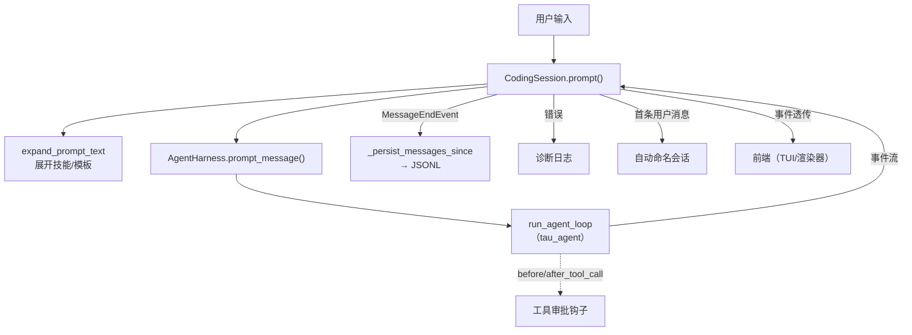
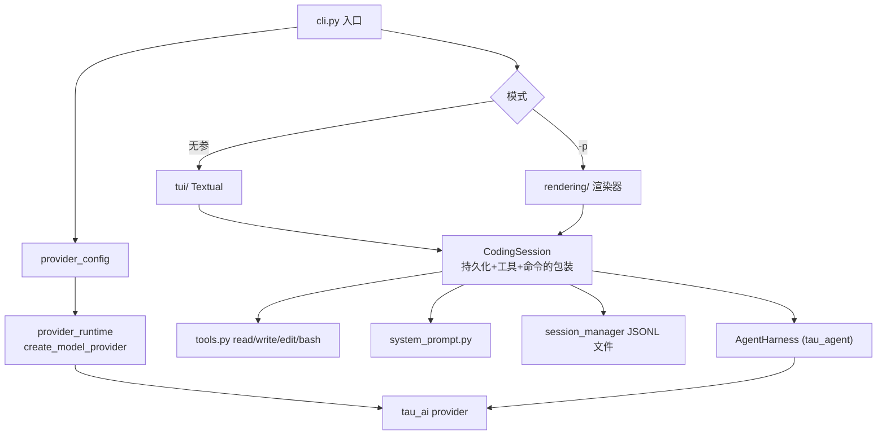

# Coding 层手册：`tau_coding`

> 本篇逐文件精读 `src/tau_coding/`。这是"把可复用大脑 `AgentHarness` 包装成一个真实、可运行、可持久化、可交互的终端编码 App"的一层。
>
> 一句话职责：**提供 CLI/TUI 前端、真实的文件/Shell 工具、系统提示、provider 配置、斜杠命令、磁盘会话，把 `tau_agent` + `tau_ai` 组合成 `tau` 命令。**

## 阅读顺序建议

```text
cli.py（入口）
  → tools.py（read/write/edit/bash）
  → system_prompt.py（系统提示）
  → session.py（CodingSession，最核心）
  → provider_config.py + provider_runtime.py（配置 → 构造 provider）
  → rendering/（print 模式渲染）
  → tui/（Textual 交互界面）
  → 其余（commands / resources / skills / session_manager / credentials ...）
```

---

## 一、`cli.py`——命令行入口

`tau` 命令映射到 `tau_coding.cli:app`（一个 `typer.Typer`）。核心是 `main()` 回调（`@app.callback(invoke_without_command=True)`），它根据参数分派到不同模式：

### 1.1 主要运行模式

| 触发 | 走向 | 关键函数 |
| --- | --- | --- |
| `tau`（无参数） | 交互式 TUI | `run_openai_tui` → `run_tui_app` |
| `tau -p "..."` / `--mode text\|json\|transcript` | 一次性 print 模式 | `run_openai_print_mode` → `run_print_mode` |
| `tau setup ...` | 注册 OpenAI 兼容 provider | `setup_command` |
| `tau providers` | 列出已配置 provider | `providers_command` |
| `tau sessions` | 列出历史会话 | `render_session_list` |
| `tau export <id>` / `--export` | 导出会话（html/jsonl） | `export_session_command` |
| `tau update` | 升级 Tau | `update_command` |
| `tau --version` | 打印版本 | — |

### 1.2 print 模式的调用链（最适合追踪学习）

```text
run_openai_print_mode(prompt, model, cwd, output, ...)
  ├─ load_provider_settings()                # 读 ~/.tau 配置
  ├─ resolve_provider_selection(...)         # 选定 provider+model
  ├─ create_model_provider(...)              # 构造 tau_ai 的 provider
  ├─ SessionManager().create_session_exclusive(...)  # 建独立会话文件
  └─ run_print_mode(...)
       ├─ CodingSession.load(CodingSessionConfig(...))  # 构建会话
       ├─ create_event_renderer(output, ...)            # 选渲染器
       ├─ 若 prompt 是 ! 开头 → run_terminal_command
       ├─ 若 prompt 是 / 开头 → handle_command
       └─ 否则：async for event in session.prompt(prompt): renderer.render(event)
```

- `_merge_stdin_prompt`：支持 `cat file | tau -p "..."`，把管道内容拼进 prompt。
- `_force_utf8_streams`：Windows 上把 stdout/stderr 强制 UTF-8（避免中文/emoji 报错）。
- `run_print_mode` 返回 `bool`——出错返回 `False`，CLI 据此以非零码退出（脚本可判断成败）。

> **教学要点**：想快速看懂"一次提问怎么跑通"，就沿着 `run_print_mode` 往下读，它比 TUI 简单得多，是全链路的最短路径。

---

## 二、`tools.py`——四个内置工具（read / write / edit / bash）

这里实现了 `tau_agent` 的 `AgentTool` 协议对应的真实编码工具。`create_coding_tools(cwd, shell_command_prefix, image_support)` 按顺序返回 `[read, write, edit, bash]`。

### 2.1 设计模式：`ToolDefinition` → `AgentTool`

每个工具先定义成 `ToolDefinition`（带 `name`、`description`、`prompt_snippet`、`prompt_guidelines`、`input_schema`、`executor`），再用 `.to_agent_tool()` 转成核心的 `AgentTool`。好处：`ToolDefinition` 保留了给系统提示用的富元数据，`AgentTool` 只保留循环需要的最小信息。

### 2.2 四个工具

| 工具 | 关键行为 | 安全/健壮性 |
| --- | --- | --- |
| `read` | 读文本（UTF-8，支持 offset/limit 分页）或图片（jpg/png/gif/webp/bmp，转成 `ImageContent`） | 超大文件/图片截断；模型不支持视觉时用占位符降级 |
| `write` | 写文本，自动建父目录，覆盖已存在文件 | 每个路径一把 `asyncio.Lock`（`_file_lock`），防并发写交错 |
| `edit` | 精确文本替换（`edits[].oldText/newText`），每个 oldText 必须**唯一且非空**，替换前全部校验 | 保留 BOM 和原换行风格；重叠编辑报错；无变化报错 |
| `bash` | 执行 shell 命令，合并 stdout/stderr | POSIX 下 `start_new_session=True`，超时/取消时 `killpg` 杀整个进程组；输出尾部截断并落盘临时文件 |

### 2.3 关键工具函数

- `truncate_head`（read 用，保留开头） / `truncate_tail`（bash 用，保留结尾）：按行数（2000）和字节数（50KB）双限截断，返回 `TruncationResult` 元数据。
- `apply_edits_to_normalized_content`：edit 的核心——把内容和编辑都归一成 LF、校验每个 oldText 恰好出现一次、检查不重叠、从后往前替换。
- `generate_diff_string` / `generate_unified_patch`：生成 ndiff 和 unified patch，放进结果 `details`。
- `_communicate_with_cancellation`：bash 的取消/超时核心——用 `asyncio.wait` 同时等待"命令完成"和"取消信号"。

> **安全提示**（对应安全铁律 RCE 项）：`bash` 工具直接执行 shell 命令，这是编码 Agent 的本质能力。Tau 的做法是把安全责任交给**上层审批钩子**（`before_tool_call`，见下文 3.4），而不是在工具里禁用。二次开发时若面向不可信输入，务必在钩子里加审批/白名单。

---

## 三、`session.py`——`CodingSession`（Coding 层最核心）

2705 行，是整个 Coding 层的心脏。它的定位（源码 docstring）：**`AgentHarness` 拥有内存里的 agent 大脑；`CodingSession` 在外面包装出真实编码会话环境**——持久化、默认工具、斜杠命令。

### 3.1 `CodingSessionConfig`（frozen dataclass）

装配一个会话所需的一切。核心字段：

| 字段 | 含义 |
| --- | --- |
| `provider` / `model` | 底层模型 provider 和模型名 |
| `storage` | `SessionStorage`（通常 `JsonlSessionStorage`） |
| `cwd` | 工作目录（工具相对路径的根） |
| `system` / `custom_system_prompt` / `append_system_prompt` | 系统提示的三种注入方式 |
| `context_files` | 项目上下文文件（AGENTS.md 等） |
| `tools` | 工具集；`None` 时用 `create_coding_tools` 生成默认 4 件套 |
| `provider_settings` / `runtime_provider_config` | 多 provider 配置（用于 `/model`、`/login` 切换） |
| `auto_compact_token_threshold` / `auto_compact_enabled` | 自动压缩配置 |
| `thinking_level` | 思考等级 |
| `skills_enabled` / `extensions_enabled` / `extension_paths` | 技能与扩展开关 |
| `shell_command_prefix` | bash 命令前缀 |

### 3.2 `CodingSession.load()`——异步工厂（装配核心）

`__init__` 只做纯内存装配（不 I/O）；真正的构建入口是 `@classmethod async def load(config)`。它负责：

1. 从 `storage.read_all()` 读所有条目，`SessionState.from_entries(...)` **重放**出历史消息、模型、thinking level 等。
2. 发现项目资源（`resources.py`：AGENTS.md / `.tau` / `.agents`）、技能（`skills.py`）、提示模板。
3. 用 `system_prompt.build_system_prompt(...)` 构建系统提示。
4. 构造工具集（默认 `create_coding_tools`）。
5. 构造 `AgentHarness(AgentHarnessConfig(provider, model, system, tools, before_tool_call=..., after_tool_call=...), messages=历史)`。
6. 装配扩展运行时、命令注册表、诊断日志等。

### 3.3 `prompt()`——用户输入的主入口（**最该精读**）

签名：`async def prompt(content, *, streaming_behavior=None, source=..., custom_type=..., details=...) -> AsyncIterator[CodingSessionEvent]`。

它的流程（贴合源码 1525-1660 行）：

```text
1. 运行扩展的 input 钩子（可拦截/改写输入）
2. expand_prompt_text(content)              # 展开 /skill: 和提示模板
3. 若 harness 正在运行：
     streaming_behavior == "steer"    → harness.steer(...) 并返回队列事件
     streaming_behavior == "follow_up"→ harness.follow_up(...) 并返回队列事件
     否则报错（已在运行）
4. 刷新模型限制、必要时自动压缩（_try_auto_compact）
5. persisted_count = len(harness.messages)   # 记住已持久化到哪
6. prompt_message = UserMessage(content=展开后文本)   # 或 CustomMessage
7. events = harness.prompt_message(prompt_message)     # ★ 进入 Agent 循环
8. async for event in events:
      若是 MessageEndEvent → _persist_messages_since(persisted_count)  # ★ 持久化
      若是 AssistantMessage 且 stop_reason=="error" → 记诊断日志/判断上下文溢出
      把 AgentEndEvent 换成 SessionAgentEndEvent 再 yield，其余原样 yield
      首条 UserMessage 结束后尝试 _try_auto_name_session（自动命名会话）
9. 收尾再 _persist_messages_since 一次
10. 若上下文溢出 → 触发 overflow 压缩并 harness.continue_() 重试
```

**关键点**：`CodingSession.prompt` 本质是 `harness.prompt_message` 的**装饰器**——它在事件流经过时做三件额外的事：**持久化**（`MessageEndEvent` 时写 JSONL）、**诊断**（错误落盘）、**自动运维**（自动命名、自动压缩、溢出重试）。

### 3.4 持久化机制：`_persist_messages_since`

- **持久化边界 = 消息生命周期事件**。每当收到 `MessageEndEvent`，就把 harness 里"上次持久化位置之后"的新消息，逐条包成 `MessageEntry` 追加到 `storage`。
- 同时会写 `LeafEntry` 更新活动叶子指针。
- 这与 `02` 篇的"append-only 树"完全对应：Coding 层负责"何时写"，`tau_agent.session` 负责"写成什么、怎么重放"。

### 3.5 工具审批钩子：`before_tool_call` / `after_tool_call`

`CodingSession` 把审批逻辑作为 `AgentHarnessConfig.before_tool_call` / `after_tool_call` 传给 harness。这正是 `02` 篇 `loop.py` 里预留的挂载点——**权限/审批在这里落地**（例如 TUI 弹窗让用户确认危险的 bash 命令、写文件等），返回 `(blocked, reason)` 决定是否拦截。

### 3.6 斜杠命令：`handle_command()`

`handle_command(text)` 把 `/xxx` 交给 `CommandRegistry` 分派。提示模板类命令（`/skill:`、模板）是"展开指令"，走 `prompt` 的展开逻辑而非命令分派。

### 3.7 终端命令：`run_terminal_command()`

`! 前缀` 的输入（如 `!ls`）不进模型，直接在 cwd 执行 shell，结果作为 `BashExecutionMessage` 记录，可选择是否加入上下文（`parse_terminal_command` 解析前缀）。

### 3.8 其他能力入口（真实方法名）

| 能力 | 方法 |
| --- | --- |
| 手动压缩 | `async def compact(instructions=None)` → 生成摘要 + 重建活动上下文 |
| 分支回溯 | `async def branch_to_entry(...)` + `async def tree_choices()`（`/tree` 命令用） |
| 切换模型 | `set_model(model)` / `set_model_choice(choice)` |
| 切换 thinking | `available_thinking_levels` / thinking 相关方法 |
| 导出 | `async def export(...)` |
| 生命周期 | `async def reload()`（重载资源/扩展）、`async def aclose()`（关闭 provider）、`async def emit_pending_session_start()` |
| 观测 | `context_usage`、`session_stats`、`context_window_tokens`、`system_prompt` 等只读属性 |
| 队列 | `queue_steering_message` / `queue_follow_up_message` / `clear_queued_messages` |

### 3.9 模块级函数

- `parse_terminal_command(text)`：判断输入是否为 `!` 终端命令，返回 `TerminalCommandRequest`。
- `jsonl_session_storage(path)`：便捷构造 `JsonlSessionStorage`。



---

## 四、`system_prompt.py`——系统提示构建

- `build_system_prompt(options: BuildSystemPromptOptions)`：确定性拼装 Pi 风格系统提示。若给 `custom_prompt` 用它做骨架，否则用内置骨架（角色 + 可用工具 + 指南 + Tau 自文档路由）。之后统一追加：`append_system_prompt` → 项目上下文 → 技能清单（仅当有 `read` 工具时）→ 当前日期 → 当前工作目录。
- `ProjectContextFile`：一个项目指令文件（`path` + `content`）。
- `format_available_tools`：用每个工具的 `prompt_snippet` 列出工具。
- `collect_prompt_guidelines` / `format_guidelines`：合并工具级 `prompt_guidelines` + 通用编码守则。
- `format_project_context`：把项目指令包进 `<project_context>` XML，用 `xml.sax.saxutils.escape` **转义**（防提示注入，对应安全铁律 XSS/注入意识）。
- `format_skills_for_prompt` / `format_tau_documentation`：技能清单 XML、Tau 自文档路由。

依赖：只依赖 `tau_agent.tools.AgentTool`（读 `name`/`prompt_snippet`/`prompt_guidelines`），不依赖 `tau_ai`。

---

## 五、`provider_config.py` + `provider_runtime.py`——配置到 provider 的桥

这两个文件把"用户可读的 provider 目录"翻译成 `tau_ai` 的运行时 provider 对象。

### 5.1 `provider_config.py`——持久化配置

- 常量：`DEFAULT_PROVIDER_NAME = "openai"`、`DEFAULT_MODEL = "gpt-5.4"`。
- 三种配置类（frozen dataclass，带校验 + `to_json`）：`OpenAICompatibleProviderConfig`、`AnthropicProviderConfig`、`OpenAICodexProviderConfig`，联合成 `ProviderConfig`。
- `ProviderSettings`：整体设置（`default_provider` + `providers` + `scoped_models`）。
- 存储位置：`~/.tau/providers.json`（只存**运行时偏好**）+ `~/.tau/catalog.toml`（存完整 provider 定义）。
- `load_provider_settings()` / `save_provider_settings()`：加载合并 catalog、原子写入（带 `.bak` 备份）。
- `resolve_provider_selection(settings, provider_name, model)`：解析出最终 `ProviderSelection`（provider + model）。
- `provider_kind(provider)`：反判 kind（anthropic / openai-codex / google-generative-ai / mistral-conversations / openai-compatible）。

### 5.2 `provider_runtime.py`——`create_model_provider`

根据 `ProviderConfig` 类型创建对应的 `tau_ai` provider（返回满足 `ClosableModelProvider` 协议、带 `aclose()` 的对象）：

```text
AnthropicProviderConfig     → AnthropicProvider（含 OAuth 处理）
OpenAICodexProviderConfig   → OpenAICodexProvider（OAuth + account_id）
OpenAICompatibleProviderConfig → 按 api 字段再分：
    anthropic-messages      → AnthropicProvider（网关代理 Claude）
    google-generative-ai    → GoogleGenerativeAIProvider
    mistral-conversations   → MistralConversationsProvider
    其他                     → OpenAICompatibleProvider
```

- OAuth 场景用 `OAuthRuntimeCredentialResolver` / `OpenAICodexCredentialResolver`：**请求前**动态解析并刷新令牌，用 `_refresh_lock`（按事件循环缓存的锁）防止并发刷新把 refresh token 用坏。

### 5.3 `provider_catalog.py` + `catalog_loader.py` + `data/catalog.toml`

- `data/catalog.toml`：**内置**模型目录（28 个 provider，含每个模型的 context_window、cost、thinking_levels 等元数据）。
- `catalog_loader.py`：加载内置 + `~/.tau/catalog.toml` 用户覆盖（`user_catalog_path()`）。
- 这就是 README 说的"加自己的 provider/模型只需丢一个 `~/.tau/catalog.toml`，无需改代码"。

---

## 六、`rendering/`——print 模式渲染器

消费 agent 事件流，一次性写到终端。核心接口 `EventRenderer`（`render(event)` + `finish() -> bool`）。

| 文件 | 内容 |
| --- | --- |
| `__init__.py` | `create_event_renderer(mode, ...)` 工厂，按 `PrintOutputMode` 分派 |
| `base.py` | `PrintOutputMode(StrEnum)`（text/json/transcript）+ `EventRenderer` 协议 |
| `plain.py` | `FinalTextRenderer`：**只输出最终答案**（最后一条助手文本），出错写 stderr 并返回 False |
| `json.py` | `JsonEventRenderer`：每个事件 `model_dump_json` 成一行 JSON（Pi 兼容流） |
| `transcript.py` | `TranscriptRenderer`：用 **Rich** `Console(stderr)` 逐事件带颜色打印（文本流式、工具调用青色、✓/✗ 绿/红、错误红色） |

三种模式对应 `tau --mode text|json|transcript`。

---

## 七、`tui/`——Textual 交互界面

Textual 前端，核心是 **adapter 边界**：`CodingSession.prompt()` 产出事件流，TUI 把每个事件交给 `TuiEventAdapter.apply(event)` 更新可变的 `TuiState`，再由 widget 增量重绘。

| 文件/概念 | 职责 |
| --- | --- |
| `run_tui_app(...)` | TUI 入口函数（`cli.py` 调用它） |
| `TauTuiApp` | Textual `App` 主类，`async for event in session.prompt(...)` 驱动 UI |
| `adapter.py` 的 `TuiEventAdapter` | **事件 → 显示状态**的翻译器（核心边界）：把 `MessageUpdate`/`ToolExecutionStart` 等翻译成对 `TuiState` 的操作 |
| `state.py` 的 `TuiState` | 可变显示状态（消息列表、流式缓冲、思考、运行状态、队列） |
| widgets | `TranscriptView`（转录视图）、`SessionSidebar`（侧栏）、输入框、`StreamingTranscriptMessageWidget` 等 |
| `themes/` | 主题（`/theme` 命令切换） |

> **架构精髓**（呼应 `AGENTS.md`）：**Textual 绝不是 `tau_agent` 的依赖**。大脑只发事件，UI 只消费事件。同一套事件既能驱动 TUI，也能驱动 print 渲染器，还能驱动你自己写的前端。这就是"事件即契约"。

---

## 八、其余支撑文件（简表）

| 文件 | 职责 |
| --- | --- |
| `commands.py` | 斜杠命令注册表 + 所有内置命令（见下） |
| `resources.py` | 加载 AGENTS.md / `.tau` / `.agents` 项目指令（`TauResourcePaths`、`ResourceDiagnostic`） |
| `skills.py` | 用户技能（`Skill`）发现与展开 |
| `prompt_templates.py` | 提示模板 |
| `credentials.py` | `FileCredentialStore`——凭据/OAuth 令牌存储（`~/.tau`） |
| `paths.py` | `~/.tau` 各路径 |
| `session_manager.py` | 会话索引（`list_sessions`、`create_session_exclusive`、`get_session`、`validate_session_id`） |
| `session_export.py` | 会话导出（html/jsonl） |
| `context_window.py` / `context.py` / `session_stats.py` | 上下文窗口、token 估算、会话统计 |
| `thinking.py` | thinking 等级（`ThinkingLevel`、`reasoning_effort_for_level`） |
| `oauth*.py` | 各家 OAuth 登录流程（`/login`） |
| `image_processing.py` | 图片校验/缩放/转码（`read` 工具用，基于 pillow） |
| `extensions/` | 扩展运行时 |
| `self_docs.py` | Tau 自文档（README/docs 路由进系统提示） |
| `update_check.py` / `updater.py` / `version.py` | 版本检查与自升级 |
| `diagnostics.py` | 诊断日志 |

### 内置斜杠命令一览（来自 `commands.py`）

`/help` `/quit`（别名 exit）`/new` `/compact` `/export` `/session` `/system` `/skill` `/skills` `/hotkeys` `/prompts` `/reload` `/resume` `/tree` `/name` `/model` `/tools` `/scoped-models` `/theme` `/login` `/logout`（还有 status/context/resources 等内部命令）。

---

## 九、本层小结



记住：**Coding 层 = 前端（CLI/TUI/渲染）+ 真实工具 + 系统提示 + provider 配置 + 磁盘会话**，它把抽象的大脑接到了真实世界。

## 延伸精读与练习

本篇给出全景；按源码依赖逐个理解文件、完成费曼复述与确定性实验时，请从
[`coding-layer/README.md`](coding-layer/README.md) 开始。该目录将资源/信任、工具、provider、
扩展、本地推理、会话、四种前端与运行维护拆成独立章节，并给出每阶段对应的测试。

下一篇：`04-全链路运行剖析.md`。
