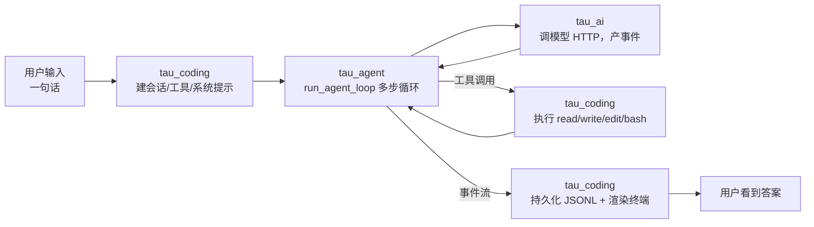
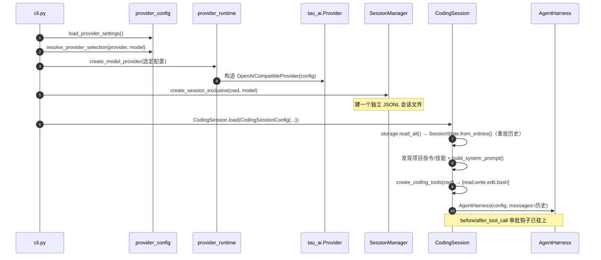
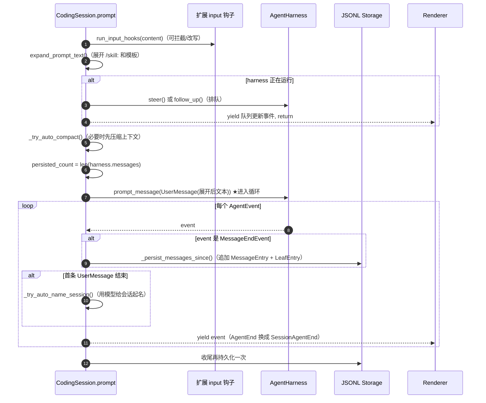
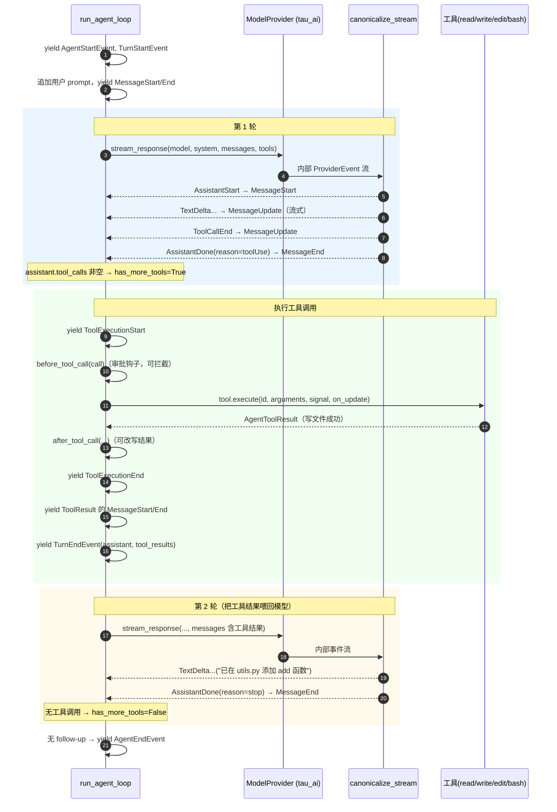
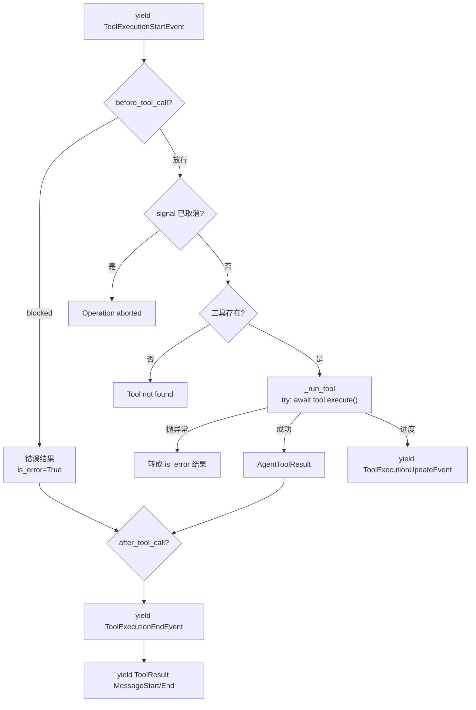
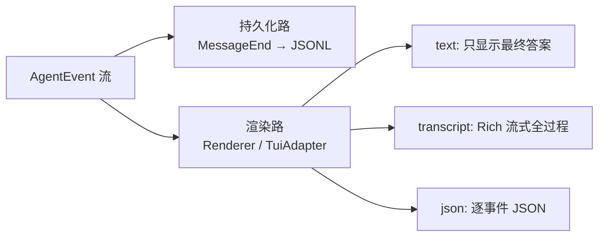
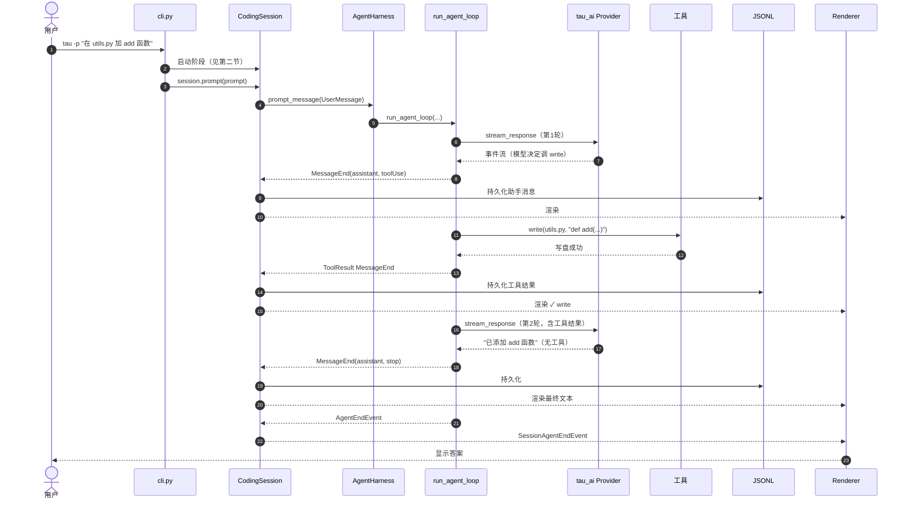
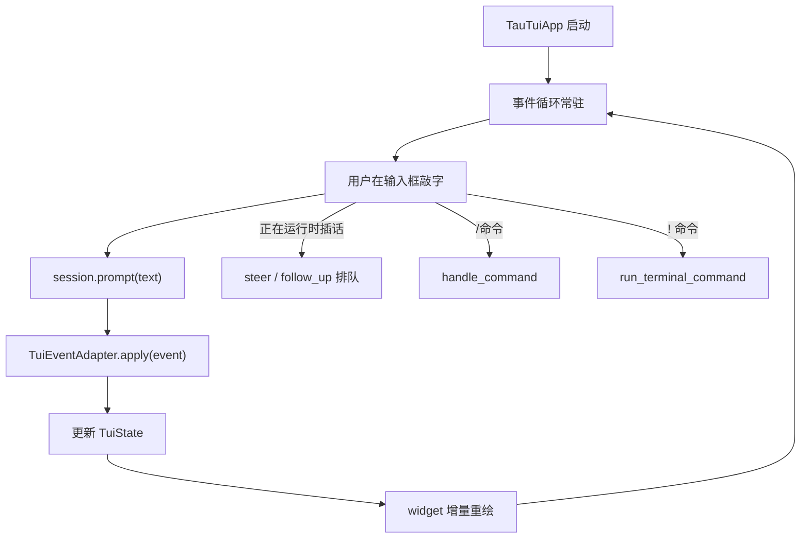

# 全链路运行剖析：一次提问从输入到输出

> 本篇把前四篇的知识串成一条线：**用户在终端敲下一句话，直到看到答案，中间到底发生了什么。**
>
> 所有步骤都对应真实源码，可对照 `04` 之前各篇的函数名逐一验证。

我们以 **print 模式**（`tau -p "在 utils.py 里加一个 add 函数"`）为主线，因为它是最短、最清晰的路径。TUI 模式的差异在最后单独说明。

---

## 一、鸟瞰：三层如何协作一次



一次提问可能触发**多轮**"模型 ↔ 工具"往返，直到模型不再请求工具为止。

---

## 二、启动阶段（还没进循环）



到这里，一切就绪：provider 能调模型、工具能操作文件、系统提示已构建、历史已加载、harness 已装配。

---

## 三、核心阶段：`session.prompt("...")` 内部

`run_print_mode` 里最关键的一行：

```python
async for event in session.prompt(prompt):
    renderer.render(event)
```

`CodingSession.prompt` 做的事（对照 `03` 篇 3.3）：



**记住两个"额外动作"**：`CodingSession.prompt` 只是在 harness 事件流经过时，顺手做了 **持久化**（`MessageEndEvent` 时写盘）和 **自动运维**（命名、压缩）。真正的编排在 harness/loop 里。

---

## 四、Agent 循环每一步（`run_agent_loop` 逐步拆解）

这是最核心的部分。`harness.prompt_message` 最终调用 `run_agent_loop`（`tau_agent/loop.py`）。下面把一次"模型请求写文件"的完整往返拆到最细。

### 4.1 循环时序总览



### 4.2 每一步在源码里对应什么

| 步骤 | 源码位置 | 说明 |
| --- | --- | --- |
| 发 `AgentStart`/`TurnStart` | `loop.py` 开头 | 编排开始 |
| 追加 prompt、发消息事件 | `for prompt in prompts` | 把用户输入入历史并广播 |
| 调模型 | `_assistant_events` → `provider.stream_response` | 唯一的外部世界入口 |
| provider 事件 → agent 事件 | `_assistant_events` | Start→MessageStart，Done→MessageEnd，其余→MessageUpdate |
| 记住助手消息 | `if isinstance(event, MessageEndEvent) and AssistantMessage` | 拿到本轮 `assistant` |
| 判断是否继续 | `has_more_tools = bool(calls)` | **模型请求了工具就继续** |
| 执行每个工具 | `_execute_tool_call` | 前置钩子→执行→后置钩子→ToolResult |
| 工具异常隔离 | `_run_tool` 的 try/except | 工具抛异常变成 `is_error` 结果，不崩循环 |
| 工具结果入历史 | 收集 `ToolResultMessage` 进 `messages` | 下一轮会喂给模型 |
| 发 `TurnEnd` | 每轮末尾 | 带本轮工具结果 |
| 拉引导消息 | `pending = get_steering_messages()` | 用户中途插话在此生效 |
| 结束判断 | 内层 while `has_more_tools or pending` | 都为假 → 跳出 |
| 追问判断 | 外层 `follow_ups = get_follow_up_messages()` | 有追问就再来一轮 |
| 发 `AgentEnd` | 最后 | 带本次新增的所有消息 |

### 4.3 一次工具调用的内部细节（放大 `_execute_tool_call`）



对应到 Coding 层：`tool.execute` 最终调用 `tau_coding/tools.py` 里 `write` 工具的执行器——加锁、建目录、写 UTF-8 文件、返回 `AgentToolResult(content="Successfully wrote to ...")`。

---

## 五、事件如何变成"你看到的字"

事件流从 loop 出来后，在 Coding 层被两路消费：

### 5.1 持久化路（写盘）

`CodingSession.prompt` 里，每个 `MessageEndEvent` 触发 `_persist_messages_since`，把新消息包成 `MessageEntry` 追加进 JSONL，并更新 `LeafEntry`。**这是 append-only 事实流的写入点**。

### 5.2 渲染路（显示）

`renderer.render(event)`（print 模式）或 `TuiEventAdapter.apply(event)`（TUI）消费事件：

- **text 模式**（`FinalTextRenderer`）：只记住最后一条助手文本，`finish()` 时打印。你只看到最终答案。
- **transcript 模式**（`TranscriptRenderer`）：`MessageUpdate` 里的 `TextDelta` 实时流式打印；`ToolExecutionStart` 青色打印工具调用；`ToolExecutionEnd` 打 ✓/✗。你看到完整过程。
- **json 模式**（`JsonEventRenderer`）：每个事件打一行 JSON，供程序解析。



---

## 六、完整数据流转（一张总图）



---

## 七、几个容易忽略但很重要的细节

1. **失败的空助手轮不喂回模型**：`_provider_context`（loop.py）会过滤掉"内容为空的 error/aborted 助手消息"，但它仍被持久化用于诊断。
2. **取消（Ctrl+C）**：`AgentHarness.cancel()` 触发 `SimpleCancellationToken`；provider 每读一行都检查，工具执行也检查；下次 prompt 前 harness 会给悬空工具调用补 `ToolResultMessage`（"interrupted by user"）。
3. **自动压缩**：prompt 前若上下文超阈值，`_try_auto_compact` 先压缩；若一轮跑完发现上下文溢出，触发 overflow 压缩并 `harness.continue_()` 重试。
4. **自动命名**：首条用户消息后，用模型另起一个请求给会话起标题（`_try_auto_name_session`）。
5. **每个流式事件都带 `partial`**：provider 级事件携带"当前累积的助手消息快照"，这让 UI 能实时重绘而不必自己拼字符串。

---

## 八、TUI 模式的差异

print 模式是"一次 prompt → 跑完 → 退出"；TUI 模式则是**常驻**的：



关键差异：

- 事件不是被"打印"，而是被 `TuiEventAdapter` 翻译成对 `TuiState` 的可变更新，再由 Textual widget 增量渲染。
- 用户可以在 agent 运行时**插话**（steering/follow-up 队列，见 `02` 篇 8.3）。
- 支持斜杠命令、`!` 终端命令、快捷键、主题切换等交互。
- 但**底层的 harness/loop/provider 完全相同**——TUI 只是另一个事件消费者。这再次印证"事件即契约、前端可替换"。

---

## 九、一句话总结全链路

> **用户输入 → CodingSession 展开并入历史 → AgentHarness 启动 run_agent_loop → 循环调 provider（tau_ai 把 HTTP 流规范成事件）→ 模型请求工具就执行（tau_coding 的 read/write/edit/bash）→ 工具结果喂回模型 → 直到模型不再调工具 → 全程事件流被持久化成 JSONL 并渲染到终端。**

下一篇：`05-拓展实操案例.md`。
