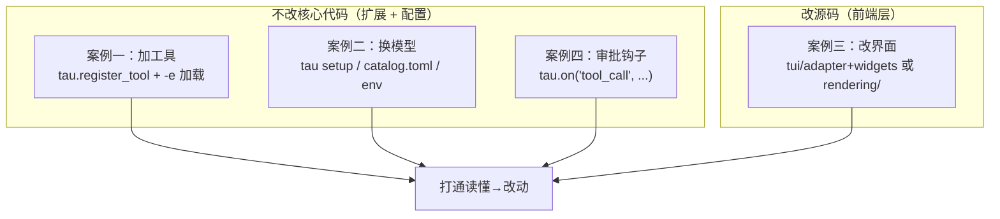

# 拓展实操案例：动手改 Tau

> 本篇给出三个入门级二次开发练习，全部基于 Tau 真实的扩展机制与配置机制，**不改动核心代码即可完成大部分**。做完这三个，你就打通了"读懂 → 改动"的最后一公里。
>
> 三个练习：
> 1. 新增一个自定义工具（不改核心，用扩展机制）
> 2. 切换到本地大模型（用配置机制）
> 3. 修改终端界面（改 TUI 主题/渲染）

---

## 案例一：新增一个自定义工具

Tau 内置了扩展机制，**加工具不需要动核心代码**——写一个带 `setup(tau)` 函数的 Python 文件，用 `tau -e` 加载即可。这正是 `examples/extensions/hello_tool.py` 演示的。

### 1.1 扩展机制原理（贴合源码）

- 扩展文件导出一个 `def setup(tau: ExtensionAPI) -> None`。
- `ExtensionAPI`（`tau_coding/extensions/api.py`）提供的关键方法：
  - `tau.register_tool(AgentTool(...))`：注册工具（同名先注册者胜）。
  - `tau.register_command(name, handler, ...)`：注册斜杠命令。
  - `tau.add_prompt_guideline(text)`：往系统提示加一条守则。
  - `tau.on("tool_call", handler)`：订阅事件（如工具调用前拦截）。
- 加载方式（`cli.py` 的 `-e/--extension`，可重复）：
  ```bash
  tau -e path/to/my_ext.py          # 加载单个文件
  tau -e path/to/ext_dir/           # 加载目录
  # 或放进 ~/.tau/extensions/ 自动加载
  ```

### 1.2 官方最小示例（照抄即可运行）

`examples/extensions/hello_tool.py` 全文（真实存在）：

```python
from tau_agent.messages import TextContent
from tau_agent.tools import AgentTool, AgentToolResult
from tau_coding.extensions import ExtensionAPI


async def _run_hello(tool_call_id, arguments, signal=None, on_update=None):
    del tool_call_id, signal, on_update
    who = str(arguments.get("who", "world"))
    return AgentToolResult(content=[TextContent(text=f"Hello, {who}!")])


def setup(tau: ExtensionAPI) -> None:
    tau.register_tool(
        AgentTool(
            name="hello",
            label="hello",
            description="Greet someone by name.",
            parameters={
                "type": "object",
                "properties": {
                    "who": {"type": "string", "description": "Who to greet."},
                },
            },
            execute_fn=_run_hello,
            prompt_snippet="Greet someone by name.",
        )
    )
```

运行验证：

```bash
uv run tau -e examples/extensions/hello_tool.py -p "用 hello 工具跟 Tau 打个招呼"
```

### 1.3 练习：写一个"统计代码行数"的工具

新建 `my_extensions/count_lines.py`：

```python
"""自定义工具示例：统计某个文件的代码行数。"""
from pathlib import Path

from tau_agent.messages import TextContent
from tau_agent.tools import AgentTool, AgentToolResult
from tau_coding.extensions import ExtensionAPI


async def _count_lines(tool_call_id, arguments, signal=None, on_update=None):
    del tool_call_id, signal, on_update
    raw = str(arguments.get("path", "")).strip()
    if not raw:
        # 说明：AgentToolResult 本身没有 is_error 字段（见 tau_agent/tools.py），
        # 温和的“参数错误”直接用文本返回即可，模型能读到并纠正；
        # 若在 execute_fn 里 raise 异常，loop 的 _run_tool 会捕获它并把
        # 最终 ToolResultMessage.is_error 置为 True（对应 02 篇工具异常隔离）。
        return AgentToolResult(content=[TextContent(text="缺少 path 参数")])
    target = Path(raw)
    if not target.is_file():
        return AgentToolResult(content=[TextContent(text=f"文件不存在: {raw}")])

    text = target.read_text(encoding="utf-8", errors="replace")
    total = text.count("\n") + (0 if text.endswith("\n") or not text else 1)
    non_blank = sum(1 for line in text.splitlines() if line.strip())
    summary = f"{raw}: 共 {total} 行，其中非空 {non_blank} 行"
    return AgentToolResult(
        content=[TextContent(text=summary)],
        details={"path": raw, "total": total, "non_blank": non_blank},
    )


def setup(tau: ExtensionAPI) -> None:
    tau.register_tool(
        AgentTool(
            name="count_lines",
            label="count_lines",
            description="Count total and non-blank lines in a text file.",
            parameters={
                "type": "object",
                "properties": {
                    "path": {"type": "string", "description": "要统计的文件路径（相对 cwd）。"},
                },
                "required": ["path"],
            },
            execute_fn=_count_lines,
            prompt_snippet="Count lines in a file (total and non-blank).",
        )
    )
```

运行：

```bash
uv run tau -e my_extensions/count_lines.py -p "统计 pyproject.toml 有多少行"
```

**要点回顾**（对应 `02` 篇工具协议）：

- 工具 = `AgentTool`（schema `parameters` + async `execute_fn`）。
- `parameters` 是标准 JSON Schema，模型据此决定怎么调。
- `prompt_snippet` 会被 `system_prompt.py` 列进"可用工具"，模型才知道有这个工具。
- 返回 `AgentToolResult`，`content` 是块列表，`details` 放结构化数据。
- **安全提示**：本例只读文件、路径来自模型。若你的工具会写文件或执行命令，务必配合案例四的审批钩子做校验（尤其防路径穿越、内网访问、任意命令执行）。

---

## 案例二：切换到本地大模型

Tau 支持任何"OpenAI 兼容"接口，包括 [Ollama](https://ollama.com/)、[LM Studio](https://lmstudio.ai/)、vLLM、llama.cpp server 等本地模型。**不改代码，只配置。**

### 2.1 原理（对应 `03` 篇 provider 配置）

- `provider_runtime.create_model_provider` 会为"openai-compatible"类型创建 `OpenAICompatibleProvider`。
- 你只要提供一个 `base_url`（本地服务地址）+ 模型名 + 一个装 key 的环境变量（本地服务可以用任意占位 key）。

### 2.2 方式 A：用 `tau setup`（推荐）

以 Ollama（默认监听 `http://localhost:11434`，OpenAI 兼容端点在 `/v1`）为例：

```bash
# 先启动本地模型
ollama serve
ollama pull qwen2.5-coder:7b

# 给本地服务一个占位 key（Ollama 不校验，但 Tau 需要一个 env 名）
export LOCAL_KEY="ollama"

# 注册一个本地 provider（写入 ~/.tau/catalog.toml + providers.json）
uv run tau setup \
  --provider-name local-ollama \
  --base-url http://localhost:11434/v1 \
  --api-key-env LOCAL_KEY \
  -m qwen2.5-coder:7b

# 直接用（setup 默认把它设为 default provider）
uv run tau -p "解释这个项目"
```

`setup_command`（`cli.py`）真实参数：`--provider-name`、`--base-url`、`--api-key-env`、`-m/--model`、`--timeout-seconds`、`--max-retries` 等，`--set-default` 默认开启。

### 2.3 方式 B：直接写 `~/.tau/catalog.toml`

参照内置 `src/tau_coding/data/catalog.toml` 的结构，在用户目录追加一个 provider：

```toml
# ~/.tau/catalog.toml
schema_version = 1

[[providers]]
name = "local-lmstudio"
display_name = "LM Studio (local)"
kind = "openai-compatible"
base_url = "http://localhost:1234/v1"
api_key_env = "LOCAL_KEY"
credential_name = "local-lmstudio"
models = ["your-local-model-id"]
default_model = "your-local-model-id"
api = "openai-completions"     # 本地模型走 chat/completions，别用 responses

[providers.context_windows]
"your-local-model-id" = 32768
```

> **关键**：本地模型一般**不支持** `/v1/responses` 端点，`api` 要设成走 `chat/completions` 的类型（对应 `01` 篇 `_use_responses_api` 的判断——名字不含 codex、不以 gpt-5.4/5.5 开头就走 chat）。若你的本地模型名恰好触发 responses 路径，改个别名即可。

然后在 TUI 里切换：

```bash
uv run tau
```
```text
/model            # 选 local-lmstudio 的模型
```

### 2.4 方式 C：纯环境变量（一次性）

如果只想临时指向本地：

```bash
export OPENAI_API_KEY="local"
export OPENAI_BASE_URL="http://localhost:11434/v1"
uv run tau -p "hi" -m qwen2.5-coder:7b
```

这条路走 `tau_ai/env.py` 的 `openai_compatible_config_from_env`（对应 `01` 篇基础设施）。

### 2.5 验证与排错

- 用 `--mode transcript` 观察是否真的连上本地服务、流式是否正常：
  ```bash
  uv run tau --mode transcript -p "写一个 hello world"
  ```
- 连不上通常是 `base_url` 写错（少了 `/v1`）或本地服务没起。
- 工具调用不生效：多数本地小模型 function calling 能力弱，先用不涉及工具的问题验证连通性。

---

## 案例三：修改终端界面（TUI）

TUI 在 `tau_coding/tui/`。改界面有两个层次：**换主题**（零代码）和**改渲染逻辑**（改源码）。

### 3.1 零代码：切换主题

```bash
uv run tau
```
```text
/theme        # 列出并切换主题
```

主题定义在 `tau_coding/tui/themes/`。想加主题就在那里加一份定义并注册。

### 3.2 改渲染：给工具调用换个显示样式

回顾 `04` 篇：TUI 的核心边界是 `TuiEventAdapter.apply(event)`（`tui/adapter.py`）——它把 `AgentEvent` 翻译成对 `TuiState`（`tui/state.py`）的更新，再由 widget 重绘。

**想改"工具调用怎么显示"**，顺着这条线找：

1. `adapter.py`：搜索 `ToolExecutionStartEvent` / `ToolExecutionEndEvent` 的处理分支，看它往 `TuiState` 写了什么。
2. `tui/widgets/`：找渲染工具行的 widget（如转录视图里表示工具调用的组件）。
3. 改它的样式/文案/图标。

> **重要原则**（呼应 `AGENTS.md`）：改 TUI 时**不要**把渲染逻辑塞进 `tau_agent`。大脑只发事件；显示怎么变是 UI 的事。你要改的永远在 `tau_coding/tui/` 或 `tau_coding/rendering/` 里。

### 3.3 更简单的练习：改 print 模式的渲染

如果你只想练手、不想碰 Textual 的复杂度，改 **print 模式渲染器**更容易（`tau_coding/rendering/transcript.py`）。例如给工具调用加个 emoji 前缀：

1. 打开 `rendering/transcript.py`，找到处理 `ToolExecutionStartEvent` 的地方（它用 Rich 打印青色工具名）。
2. 在打印工具名前加一个图标字符串。
3. 验证：
   ```bash
   uv run tau --mode transcript -p "读一下 README.md"
   ```

这样你能立刻在终端看到自己的改动，且不涉及 Textual 事件循环，非常适合第一次改渲染。

---

## 案例四（进阶）：工具调用审批钩子

这是最贴近真实需求的扩展：**在危险命令执行前拦截**。Tau 已有官方示例 `examples/extensions/permission_gate.py`（真实存在），用 `tau.on("tool_call", ...)` 订阅：

```python
import re
from tau_coding.extensions import ExtensionAPI, ToolCallHookEvent, ToolCallHookResult

DANGEROUS_PATTERNS = (
    re.compile(r"\brm\s+-(?=[a-zA-Z]*r)(?=[a-zA-Z]*f)[a-zA-Z]+"),
    re.compile(r"\bgit\s+push\s+--force"),
    re.compile(r"\bgit\s+reset\s+--hard"),
    re.compile(r"\bchmod\s+-R\s+777\b"),
    re.compile(r"\bdd\s+if="),
    re.compile(r"\bmkfs\b"),
)

def _gate_tool_call(event: ToolCallHookEvent, context) -> ToolCallHookResult | None:
    del context
    if event.tool_name != "bash":
        return None
    command = str(event.arguments.get("command", ""))
    for pattern in DANGEROUS_PATTERNS:
        if pattern.search(command):
            return ToolCallHookResult(
                block=True,
                reason=f"command matches guarded pattern `{pattern.pattern}`; "
                       "ask the user to run it manually if it is intended",
            )
    return None

def setup(tau: ExtensionAPI) -> None:
    tau.on("tool_call", _gate_tool_call)
```

这与 `02` 篇 `loop.py` 的 `before_tool_call` 钩子一脉相承——**返回 `block=True` 就拦截，模型只看到拒绝原因，工具不执行**。运行：

```bash
uv run tau -e examples/extensions/permission_gate.py
```

> **安全落地**（对应安全铁律 RCE）：这就是给 `bash` 工具加护栏的正确姿势——不改核心、用扩展钩子做黑名单/审批。生产场景建议改成**白名单**（默认拒绝、显式允许），并对写文件工具做路径校验（禁止逃出 cwd）。

---

## 三个案例小结



关键心法：

1. **加能力优先用扩展机制**（`setup(tau)` + `-e`），不要动核心包。
2. **换模型只是配置**，`tau_ai` 的统一协议让任何 OpenAI 兼容服务即插即用。
3. **改显示只碰前端层**（`tui/` 或 `rendering/`），大脑（`tau_agent`）永远只发事件。
4. 每次改动都用 `--mode transcript` 快速肉眼验证，用 `uv run pytest` 跑测试兜底。

---

## 学习收尾

至此，本系列六篇文档完成：

- `00` 建立整体认知与学习路线；
- `01`/`02`/`03` 分层吃透 AI / Agent / Coding 三层源码；
- `04` 把三层串成一次完整的运行时序；
- `05`（本篇）动手改，验证理解。

建议的巩固路径：**照着 `05` 把三个案例都跑一遍**，然后回到 `02` 篇重读 `run_agent_loop`——当你能对着代码在脑子里"手动执行"一遍循环时，你就真正吃透了这个项目。
